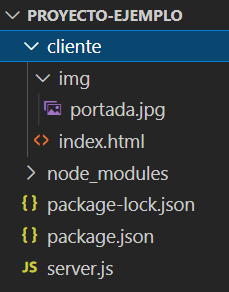

# El Servidor Web

## Definición

El servidor web (_web server_) es la "parte de atrás" (el "back end") de nuestra aplicación. Es el código que vamos a escribir para poder procesar información recibida desde nuestro sitio y enviar información solicitada. Un servidor web tiene que estar permanentemente "escuchando" a ver si llega algún mensaje para procesar. Y esa escucha se hace en un punto de entrada específico del servidor: un puerto. Una computadora tiene más de 65 mil puertos disponibles, y solo pueden ser utilizados por una aplicación (cualquier aplicación que escucha un puerto lo tiene "tomado", y ninguna otra puede utilizarlo). Los puertos se identifican por número. Los que están por debajo del 1024 son puertos *estandarizados* para ciertos usos: entrada de mails, salida de mails, etc. Por encima de ese número, en principio, podemos utilizar cualquier puerto que esté libre.

Nuestro servidor web va a estar escuchando ese puerto y cada vez que llegue un pedido (request) retornará una respuesta (response). Esa será la dinámica de comunicación de un servidor web: petición/respuesta (o, en inglés, request/response).

## Peticiones (requests)

Los requests (o peticiones) son los mensajes que se envían al servidor, esperando una respuesta. Los mensajes tendrán como destino alguna **ruta (path)** dentro del servidor, e indicarán también un **método** (method), que especifica un tipo de acción. Los valores posibles para el método son pocos, y los más utilizados son **GET** y **POST**. La acción definida por el método condiciona la posibilidad de usar ciertos datos en la estructura del request e indica la categoría de lo que se va a hacer. Por ejemplo, el método **GET** refiera a una consulta de información ("get" significa "traer") que no va a hacer ninguna modificación, mientras que **POST** se utiliza para afectar datos en el servidor o para enviar información sensible (por ejemplo, un password). La ruta, por su parte, es la parte de la url que sigue a la dirección. Por ejemplo:

* en la url https://es.wikipedia.org/wiki/World_Wide_Web la ruta es /wiki/World_Wide_Web
* en https://twitter.com/notifications es /notifications
* en http://localhost:3000/login es /login


Además de indicar ruta y método, el request contiene información, distribuida en distintos componentes del mismo. Esos componentes son:
* **Cabecera (header)**: un área con varios datos referentes a seguridad y algunos otros como el **tipo de contenido (content type)**, que indica qué tipo de datos estamos enviando.
* **Cuerpo (body)**: el cuerpo principal de datos, utilizado por ejemplo en requests de tipo POST.
* **Query string**: podríamos traducirlo como "cadena de consulta", y son los datos que se envían en un request como parte de la url misma (usado en requests tipo GET).

## Endpoints

Un endpoint es un "punto de entrada" del servidor. El endpoint se define por la combinación del **método** y la **ruta** a la que se envía un request. Por ejemplo, un endpoint puede recibir requests con método GET a la ruta "/home", o escuchar requests POST a la ruta "/login".

## Usando Node para un web server

En nuestro caso el servidor lo vamos a hacer con Node. Otros lenguajes populares para esto son PHP, C#, Java, Ruby o Python.

Node tiene una librería nativa para poder desarrollar un servidor web llamada `http`. A través de ella se puede acceder a los puertos de comunicación y enviar y recibir peticiones que utilicen el protocolo http, pero su uso es bastante complejo. Por eso la grandísima mayoría de los servidores web Node utilizan una librería muy popular llamada Express que facilita mucho la tarea.

## Express

Express es una librería que nos permite montar un servidor web con mucha facilidad. La vamos a descargar de npm ejecutando, como ya dijimos,

```bash
npm install express
```
Hecho esto vamos a ver que se agrega la carpeta "express" y unas 50 carpetas más con todos los otros paquetes que a su vez utiliza Express. Todo esto lo podemos ver en [la página de npm de Express](https://www.npmjs.com/package/express). Y también hay documentación oficial disponible en [su sitio web](http://expressjs.com/).

## Iniciando el servidor

Lo primero que tenemos que hacer es importar Express. Lo que hacemos es crear una constante (que llamaremos "express") y guardar ahí el retorno de la importación del módulo de Express (que siempre tiene el mismo nombre con el que se instaló desde npm).

```js
const express = require("express");
```

En este caso lo que retorna express contiene una función que podemos ejecutar para crear el servidor. Como esa función nos quedó guardada en la const "express", la ejecutarmos y guardaremos su resultado de la siguiente forma:

```js
const express = require("express");
const app = express();
```

Ahora ese objeto "app" es el que va a permitirnos poner a correr nuestro servidor. Lo primero que tenemos que hacer es indicarle que escuche en algún puerto. Vamos a utilizar el puerto 3000:

```js
const express = require("express");
const app = express();

app.listen(3000);
```

Si ejecutamos este código con node, el servidor ya se estaría ejecutando. Pero no lo notaríamos, ni tendríamos nada para hacer con él aún. Para enterarnos cuando terminó de iniciar y ya está escuchando, podemos poner una función como 2do parámetro, y será el _callback_ que se ejecutará cuando ya esté escuchando. Por ejemplo:

```js
const express = require("express");
const app = express();

app.listen(3000, function(){
  console.log("Escuchando en puerto 3000");
});
```
mostrará _"Escuchando en puerto 3000"_ por consola cuando ya esté escuchando.

## Definiendo endpoints

Ahora necesitamos programar algún endpoint para poder responder peticiones. La primer petición que solemos querer responder es la que nos llega cuando alguien quiere ingresar a la página incial de nuestro sitio, escribiendo solo su dirección sin ninguna ruta específica, por ejemplo "https://www.facebook.com". Escribir solo eso equivale a escribir "https://www.facebook.com/". Es decir, cuando no se indica una ruta, se está solicitando la "ruta raíz", que es simplemente "/". Y cuando esa petición la realiza el navegador porque escribimos esa url en su barra de direcciones, entonces el método utilizado es siempre GET.

Por lo tanto, este endpoint tiene que definir una respuesta para un request GET a la ruta "/". Lo escribimos en Express de esta forma:

```js
app.get("/", function() {
  // Aquí tenemos que poner el código para este callback
})
```

La función ".get" es la que utilizamos para definir endpoints que respondan a ese método. El primer parámetro es la ruta (en este caso "/") y el segundo es la función que será ejecutada si llega una petición (es decir, esa función es un callback).

Dicha función es invocada por Express cuando detecta un request con las características necesarias (en este caso método GET, ruta "/"), y le pasa como parámetro dos objetos: uno que contiene información de la petición y otro para armar la respuesta. Es decir, uno que representa al request y otro al response. Típicamente los llamamos "req" y "res". Y lo primero que vamos a ver de ellos es la función "send" del objeto "res", que sirve para enviar una respuesta. Por ejemplo, el código del web server para responder "Hola mundo" a un request a nuestra ruta raíz queda:

```js
const express = require("express");
const app = express();

app.get("/", function(req, res) {
  res.send("Hola mundo");
})

app.listen(3000, function(){
  console.log("Escuchando en puerto 3000");
});
```

Si ejecutamos este código ya tendremos corriendo el servidor. Ahora para probarlo tenemos que ir al navegador e indicarle la dirección y ruta a la que queremos navegar (es decir, a la que queremos enviar un request GET) para ver la respuesta. Como el servidor está corriendo en nuestra computadora, tenemos que indicar su dirección en la barra del navegador. La dirección IP de la propia computadora siempre es 127.0.0.1, y tiene un alias (otro nombre) más sencillo: "localhost". Para navegar, entonces, a nuestro servidor, pondremos en la barra de direcciones del browser:

```
localhost:3000
```

Esto equivale a http://localhost:3000/, el navegador asumirá por defecto el protoclo y enviará el request HTTP a la ruta "/" con método GET. Lo que veremos, entonces, es "Hola mundo" en la ventana del browser.

Con la misma lógica podremos definir endpoints para distintas rutas y distintos métodos.

## Query parameters (o query string)

Los query parameters son los datos o parámetros que se puden recibir como parte de la url, en una estructura "clave/valor" después de un signo de pregunta. Por ejemplo, en

```
https://www.youtube.com/watch?v=Rfw0Qni8YHo
```

se está enviando como parámetro un dato "v" con valor "Rfw0Qni8YHo" (en este caso, un código que identifica el video).

Podemos enviar varios parámetros separándolos por "&". Por ejemplo:

```
https://tienda.havanna.com.ar/categoria/alfajores/?orderby=rating&min_price=560&max_price=1120
```

Contiene los datos:

orderby = rating
min_price = 560
max_price = 1120

Observen que los datos se escriben todos igual, no hay comillas para indicar si es string o número. Todos son strings y como tales los vamos a recibir.

Del lado del servidor, si nos llega un request con query string en la url, Express nos va a dejar esos datos dentro de un objeto `query` incluido en el objeto del request. Así, por ejemplo, tomando la url de la Tienda Havanna del ejemplo, podríamos recibir esos datos de esta forma:

```js
app.get("/categoria/alfajores", function(req, res) {
  /* Acá tendríamos un objeto req.query con esta forma:
     req.query = {
      orderby: 'rating'
      min_price: '560'
      max_price: '1120'
     }

     y podríamos acceder al valor del dato "orderby", por ejemplo, como req.query.orderby
  */
});
```

## Body y body parsers

Análogamente, podemos definir endpoints para requests "POST" con la función .post(), que también recibe la ruta como primer parámetro y el callback como segundo. Por ejemplo:

```js
app.post("/login", function(req, res) {
  // ...
})
```

En el caso del request POST, lo habitual es recibir los datos que sean necesarios en el cuerpo del request, llamado "body". Express nos facilita el acceso a ese cuerpo de datos en una propiedad .body del objeto req. Pero si esa información viene codificada como JSON (Content-Type: "application/json") o como información de un formulario (Content-Type: "application/x-www-form-urlencoded") necesitamos configurar la "decodificación" de esos datos para poder tenerlos en el objeto req.body como un objeto javascript.

Para esto utilizamos algo que llamamos "middlewares". Un middleware "algo que va en el medio", entre que llega un request y nuestros endpoints lo toman. Ese middleware no es otra cosa que una función que se ejecuta sobre cada request que llegue y hace algo que depende de su finalidad. Un middleware puede decidir no hacer nada, agregar datos en el objeto del request o responder un request sin que llegue a nuestros endpoints, por ejemplo. En el caso de la decodificación que hablamos, lo que tienen que hacer esos middlewares es reconocer el tipo de información que llega y transformarla para disponibilizarla en el objeto req.body, y dejar que el request siga su curso para ser tomado por el callback del endpoint correspondiente. Son lo que llamamos un "body parser". Esto antes lo hacíamos con una librería "body-parser", pero hace poco fue incorporada en Express, así que no necesitamos importar nada más.

Por suerte no tenemos que escribir esas funciones, porque Express ya nos las facilita, así que solo tenemos que indicarle que las use. Para configurar un middleware usamos la función ".use" de Express, que recibe como parámetro la función del middleware propiamente dicha. Para interpretar, por ejemplo, datos de un formulario, agregaríamos la siguiente línea:

```js
const express = require("express");
const app = express();

app.use(express.urlencoded({ extended: true }));
```

Observemos que:
* urlencoded es una función que está en el objeto express (el módulo importado de npm)
* Le pasamos un parámetro que es un objeto con la propiedad "extended" en true, para permitir que sean decodificados formularios más complejos. Si la propiedad está en false, solo interpreta strings y arrays (que igualmente sería mayormente suficiente en nuestro caso). Pueden leer más sobre esto en [la documentación de Express](https://expressjs.com/es/api.html)
* Esta función a su vez retorna otra función, que es la que se está pasando como parámetro a `app.use`

Otro caso típico es que el cuerpo de un request venga en formato JSON. Para eso también usamos un _body parser_ que nos da Express:

```js
app.use(express.json());
```

Nótese que podemos poner ambos middlewares juntos, porque cada uno modificará lo que corresponda. Es decir que, por ejemplo, el de JSON solo va a modificar el req.body si el Content-Type del request recibido es "application/json". Así, podemos encontrarnos con la necesidad de usar ambos body parsers y no es ningún problema:

```js
const express = require("express");
const app = express();

app.use(express.urlencoded({ extended: true }));
app.use(express.json());
```

## Recursos estáticos

Lo último que necesitamos configurar de nuestro web server para los usos básicos es la posibilidad de que el servidor pueda retornar los archivos que son solicitados por las páginas que enviamos. Lo que llamamos "recursos estáticos": imágenes, archivos CSS, archivos JS, etc.

Cuando el navegador esté procesando algún HTML que enviamos al navegador y se encuentre con un `<link>`, un `<script src="...">` o un ``, por ejemplo, automáticamente va a solicitar al mismo servidor de donde cargó la página que facilite ese archivo (ese recurso). Para que Express pueda resolver esa solicitud, tenemos que indicarle cuál es la ruta en la que lo tiene que buscar.

Para eso también utilizaremos un middleware que viene con Express, configurado por ejemplo de la siguiente forma:

```js
app.use(express.static('..........'));
```

donde los puntos corresponden a la ruta que tenemos que pasarle. Podríamos usar una ruta absoluta de nuestro servidor (que en este momento es nuestra propia computadora):

```js
app.use(express.static('C:/Proyectos/mi-web-server/cliente/'));
```

pero en cuanto subiéramos nuestra app a otro server, tendríamos que modificar eso, y es posible incluso que no pudiéramos conocer esa ruta. Pero lo podemos resolver más fácil. Siempre nuestros recursos van a estar dentro de la carpeta de nuestro proyecto, así que podríamos indicar la ruta **relativa** a la ubicación del .js donde estamos escribiendo este servidor. Entonces, por ejemplo, supongamos esta estructura:



donde la carpeta cliente está al mismo nivel que el server.js (nuestro .js que contiene el código del servidor que estamos haciendo).

En este caso, acceder "portada.jpg" desde la ruta del server sería ir a la carpeta "/cliente/img". Pero también podría tener css en una carpeta "cliente/css" y scripts en una carpeta "cliente/js", por ejemplo. Y si esos CSSs, JSs o imágenes fueran utilizadas desde mi `index.html`, los estaría usando así:

```html

```

Es decir, el html está en "/cliente" y los recursos que vincula los busca a partir de ahí: /img, /css, /js, etc. Con lo cual la carpeta "/cliente" es para nosotrxs la carpeta base de recursos estáticos.

Pero ¿cómo indicar una ruta relativa en Node? El entorno de Node nos provee la ruta absoluta en la que está nuestro archivo .js en la constante `__dirname`. Así, si estamos en "C:/Proyectos/mi-web-server/", por ejemplo, ese será el valor de `__dirname`.

Entonces, podemos construir una ruta relativa concatenando a __dirname la ruta de nuestra carpeta. Pero ¿hasta dónde llega __dirname? ¿Tenemos que incluir la "/" en la ruta que vamos a armar? Estoy en Windows, ¿Es "/" o "\"? Para solucionar este tipo de dudas, utilizamos una herramienta que nos da Node para armar rutas sin tener que estar preocupándonos por esas cosas. Es un módulo que tenemos que importar pero que no requiere ser instalado porque viene con Node, y se llama "path". Usaremos la función "join" para unir partes y contruir así una ruta.

En nuestro caso, entonces, lo haríamos así:

```js
const express = require("express");
const path = require("path");

const app = express();

app.use(express.static(path.join(__dirname, "cliente"));
```

Y así estaríamos indicando a Express que cualquier solicitud de recursos estáticos la tiene que buscar a partir de esa ruta (en el ejemplo, "C:/Proyectos/mi-web-server/cliente"). Es decir que si llega un pedido de "img/portada.jpg", la va a buscar en "C:/Proyectos/mi-web-server/cliente/img/portada.jpg", que es donde está.

## Retornando páginas HTML

Una de las cosas que podemos querer es que nuestro servidor pueda retornar (pueda "servir") nuestras páginas HTML. Retornar HTML para que el navegador lo interprete es simplemente retornar _el texto_ que representa ese HTML. Es decir, el código HTML como tal. Y el tipo de contenido va a ser puesto automáticamente por Express (Content-Type: "text/html").

Podríamos retornar ese HTML escribiéndolo directamente. Por ejemplo:

```js
app.get("/", function(req, res) {
  res.send('<html><body><h1>Hola mundo</h1><p>Esta es una página de prueba</p></body></html>');
})
```

Como podemos ver, no sería ni muy cómodo ni muy fácil de mantener ni de entender. Típicamente nuestro HTML lo vamos a tener escrito en un archivo y lo que queremos es que se envíe el contenido de ese archivo. Lo hacemos con otra función que Express nos facilita en el objeto response: "sendFile".

```js
app.get("/", function(req, res) {
  res.sendFile(path.join(__dirname, "index.html"));
})
```

Esta es la forma fácil en la que podemos enviar como respuesta lo que tenemos en un archivo HTML. La contra de esto es que no podemos modificar ese HTML según la necesidad, pero eso lo resolveremos más adelante con plantillas para renderizado del lado del servidor (_server-side rendering_).


## Ejemplo completo del servidor básico

Todo esto se podría combinar, por ejemplo, de esta forma:

index.html (solo el body)
```html
<body>
  <form action="/login" method="post">
    <input type="text" name="user" id="user">
    <input type="password" name="pwd" id="pwd">
    <input type="submit" value="Login">
  </form>
</body>
```

```js
const express = require("express");
const path = require("path");

const app = express();

// Middleware para los archivos estáticos
app.use(express.static(path.join(__dirname, "cliente"));
// Body parser para el form
app.use(express.urlencoded({ extended: true }));

// Ruta inicial, retorna el index.html que contiene un form de login
app.get("/", function(req, res) {
  res.sendFile(path.join(__dirname, "index.html"));
});

// Recibe el submit del form de login que enviamos en index.html
app.post("/login", function(req, res) {
  // Valida que user/pwd sean admin/admin
  if (req.body.user === "admin" && req.body.pwd === "admin") {
    // Es válido, envía la página principal (imaginemos que hay un home.html)
    res.sendFile(path.join(__dirname, "home.html"));
  } else {
    // Usr o pwd inválidos, se envía otra vez al login
    res.sendFile(path.join(__dirname, "index.html"));
  }
});

// Inicia el server
app.listen(3000, function(){
  console.log("Escuchando en puerto 3000");
});
```
