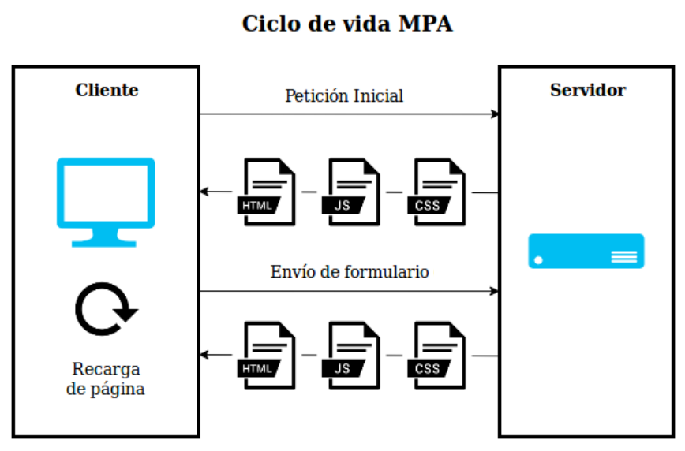

# Arquitecturas de web apps

El funcionamiento de una aplicación web implica siempre algún tipo de interacción entre cliente (front-end) y servidor (back-end). Esa interacción puede tomar varias formas, configurando distintas _arquitecturas_, según nuestra necesidad.

## Arquitectura MPA

**MPA** significa _Multiple Page Application_ (aplicación de páginas múltiples), y como su nombre indica, se trata de aplicaciones que utilicen muchas páginas. Es decir que cada _vista_ diferente que tengamos que dependa de datos nuevos del servidor, va a ser una página (un HTML) diferente.

Esto significa que cuando cambiamos de una vista a otra, cuando necesitamos usar datos nuevos que tenemos en el servidor (ver el detalle de un producto, mostrar los resultados de una búsqueda de vuelos, mostrar un artículo completo al clickear en la imagen de la noticia, etc.), estamos trayendo una página nueva del servidor, y se observa una recarga en el navegador (como cuando entramos a una noticia en un diario, a un artículo en Wikipedia, a un producto en MercadoLibre o a un resultado de búsqueda de vuelos en Despegar).

La primer vista de una web app siempre es una página que se carga del servidor en la primer petición (request). Pero en una MPA, cualquier cambio de vista posterior también seguirá el mismo ciclo de petición/recarga.

La respuesta (response) de esos _requests_ es siempre una página HTML con sus correspondientes CSS y JS si los tuviera. Esa página puede ser una página que ya existía en esa forma, como archivo HTML, en el servidor y simplemente es entregada como respuesta, o podría ser también una página **generada dinámicamente en el servidor**. En este curso vamos a aprender ambos abordajes.

Siempre que hablamos de request y response (o petición y respuesta), sea en MPA o SPA, estamos hablando de comunicaciones con el protocolo **HTTP**.

## Arquitectura SPA

**SPA** significa _Single Page Application_ (aplicación de una sola página), y define el caso de apps que utilizan una única página HTML. Es decir que cada _vista_ diferente que tengamos va a ser una modificación dinámica del DOM sobre el mismo HTML que estamos viendo.

Esto significa que cuando cambiamos de una vista a otra no hay recarga de la página, sino que se quitan, agregan y/o modifican elementos en el momento. Suele dar una experiencia de uso más fluida, pero no siempre es útil.

La primer vista también va a ser una página traida del servidor. Pero en una SPA los cambios siguientes que necesiten información nueva del servidor, ya no van a solicitar una página nueva (HTML, CSS y JS) sino que solamente van a requerir la información necesaria (datos), procesarla y modificar la vista con esa información. Esa forma de pedir información es lo que llamamos AJAX, y el típico formato en el que recibiremos los datos será JSON. Ambas cosas las veremos más adelante.

Una app SPA es, por ejemplo, GMail, YouTube, Netflix o Spotify. También otras más simples como esta página de una agencia digital inglesa: https://www.digitalagencylondon.co.uk/

## Arquitectura híbrida

Una cosa de lo más común es usar una combinación de las dos arquitecturas: lo que llamamos arquitectura _híbrida_. Eso significa que nuestra aplicación puede requerir varias páginas, pero que a su vez algunas de esas páginas utilicen AJAX para traer información del servidor sin cambiar de página.

Un ejemplo puede ser Facebook, que resuelve algunas cosas con peticiones AJAX (por ejemplo, actualizar el feed, agregar notificaciones, marcar mensajes o notificaciones como leídas o registrar los likes) y otras cosas cambiando de página (por ejemplo, si voy al centro de mensajes o a la tienda). Lo mismo pasa con Twitter (feed vs mensajes), Wikipedia (vista previa de artículo vs entrar al artículo), etc.