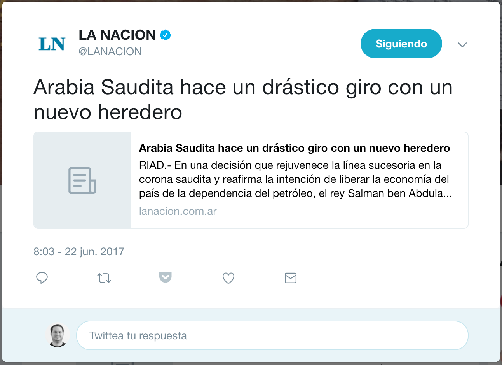
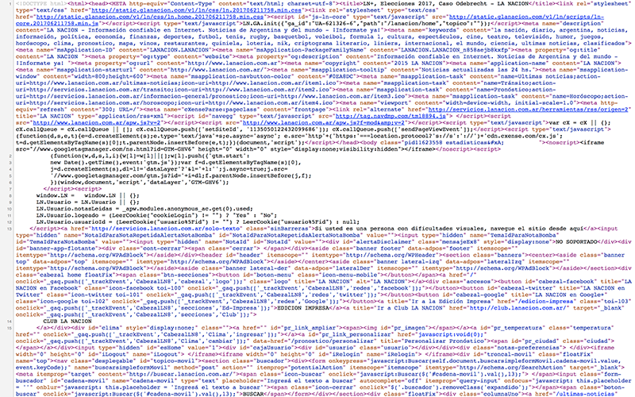
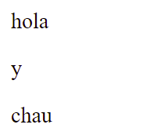
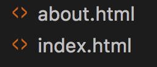
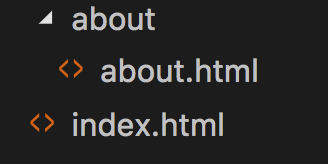

# HTML - HyperText Markup Language

## ¿Qué es HTML?

[HTML](https://developer.mozilla.org/es/docs/Web/HTML) significa [HyperText Markup Language](https://es.wikipedia.org/wiki/HTML) o lenguaje de marcas de hipertexto y se utiliza para estructurar documentos web.

Un lenguaje de marcas utiliza etiquetas para definir estructuras y mostrar distintos tipos de datos como pueden ser textos, imagenes, videos, etc.

Podemos decir que el HTML describe la estructura de nuestro documento o página utilizando etiquetas (tags).

Para conocer más sobre los distintos tipos de etiquetas podemos utilizar el sitio de [Mozilla Developer Network o MDN](https://developer.mozilla.org/es/docs/Web/HTML/Elemento).

Existen diferentes versiones de HTML y en la actualidad utilizamos la versión de [HTML5](https://es.wikipedia.org/wiki/HTML5).

Muchas paginas web son la versión electrónica de documentos reales. Por ejemplo en [lanacion.com.ar](http://www.lanacion.com.ar) podemos encontrar la versión digital del contenido que sale publicado en el diario de manera física.

En la publicación [Carreras de drones: cómo entrenan y quiénes compiten en la Argentina](http://www.lanacion.com.ar/2020025-carreras-de-drones-como-entrenan-y-quienes-compiten-en-la-argentina) podemos ver un claro ejemplo de como estructurar una noticia.

**Tenemos un título principal:**

```
Carreras de drones: cómo entrenan y quiénes compiten en la Argentina
```

**Una bajada:**
```
[Video] Leonardo Cascavilla y Santiago Nardi integran el Ezeiza Team; en +Despiertos contaron en qué consiste la Led Cup 2017
```

**La nota:**
```
Las carreras de drones se hacen en todo el mundo..
```

**Material audiovisual (el video)**

**Autor:**
```
Martina Rua
```

**Fecha:**
```
MIÉRCOLES 03 DE MAYO DE 2017 • 12:01
```

**Etiquetas realacionadas:**
```
Drones
```

En un artículo más largo podemos encontrar más secciones con otros títulos, textos e imagenes. Estas estructuras ayudan al lector a entender la noticia y de alguna forma estamos acostumbradxs a este formato. También podemos hacer un análisis similar en un blog post como puede ser [medium.com](https://medium.com/@kentcdodds/classes-complexity-and-functional-programming-a8dd86903747).

De alguna forma estamos acostumbradxs a este tipo de estructuras gracias a los diarios u otro tipo de publicación física similar. Ahora bien, ¿qué pasa cuando tenemos que estructurar otro tipo de documentos como puede ser un Twit?



En este ejemplo podemos ver:

**Contenido:**
```
Arabia Saudita hace un drástico giro con un nuevo heredero
```

**Fecha:**
```
8:03 - 22 jun. 2017
```

**Imagen**

**Datos del autor:**
```
El avatar de la nación
```

**Campo de texto para ingresar una respuesta:**
```
Twittea tu respuesta
```

**Botones para interactuar:**

* Siguiendo o seguir a usuarix
* Respuestas
* Retwittear
* Agregar a Pocket
* Poner que me gusta
* Mandar un mensaje directo a otrx usuarix

En síntesis a la hora de crear páginas web nos vamos a encontrar que cada uno de nuestros proyectos va a tener secciones que tiene una estructura particular. HTML nos brinda las etiquetas para describir las distintas partes de nuestro documento.

**La Nación en HTML:**


## Estructura

### Estructura de un tag de HTML (etiqueta)
Una etiqueta actúa como un contenedor y describe los datos o información que contienen entre la etiqueta de apertura y la de cierre.

```html
<tipoDeEtiqueta>Contenido</tipoDeEtiqueta>
```

Una etiqueta esta compuesta por: 

**Etiqueta de apertura:**
* `<` un signo menor que se conoce como apertura de la etiqueta
* `tipoDeEtiqueta` puede ser una o varias letras que describen el tipo de etiqueta que queremos crear (título, link, imagen, etc)
* `>` un signo mayor que se conoce como cierre de la etiqueta

```html
<tipoDeEtiqueta>
```
**Contenido:**

* El contenido de la etiqueta puede ser un texto u otro/s elemento/s HTML

```html
<tipoDeEtiqueta>¡Bienvenidos a HTML!
```

**Etiqueta de cierre:**
* Tiene la misma estructura que la etiqueta de apertura
* Se tiene que llamar igual que la estrcutura de apertura para que el browser entienda que acá termina lo que comenzó con la etiqueta de apertura
* `/` tiene una barra inclinada para determinar que es una etiqueta de cierre (sino sería igual que la de apertura) 

```html
</tipoDeEtiqueta>
```

**Elemento:**
* Con las etiquetas de apertura y cierre (veremos que hay excepciones, de todos modos) y el contenido conformamos lo que llamamos un **elemento**

```html
<tipoDeEtiqueta>¡Bienvenidos a HTML!</tipoDeEtiqueta>
```

**Elementos sin contenido:**
* Algunas etiquetas no tienen contenido y funcionan como _"placeholder"_ (ocupa un lugar donde vamos a poner algo).
* Este tipo de etiquetas utilizan la apertura y cierre en una sola estructura
* Un ejemplo de este tipo de etiquetas es el contenedor para insertar una imagen.

```html

```

En la mayoría de los elementos sin contenido no es necesaria esa etiqueta de cierre (aunque hay excepciones) y pueden escribirse así:

```html

```

**Ejemplo de un elemento conteniendo otro elemento:**
En el siguiente ejemplo tenemos una etiqueta `<tipoDeEtiqueta>` que tiene como contenido un texto (¡Bienvenidos a HTML!) y una imagen.

En este ejemplo vemos que el texto y la imagen tienen un márgen izquierdo para visualizar de forma rápida y fácil que son contenido del elemento `tipoDeEtiqueta`. Esta técnica se conoce como [indentado](https://es.wikipedia.org/wiki/Indentaci%C3%B3n) y es una buena práctica para evitar tener problema a la hora de armar documentos con estructuras más complejas.

```html
<tipoDeEtiqueta>
  ¡Bienvenidos a HTML!
  
</tipoDeEtiqueta>
```

### Estructura de un documento HTML

Típicamente un documento HTML va a tener las siguientes estructuras principales:

* Declaración de tipo de documento (`doctype`)
* Etiqueta `html` que actúa como contenedor principal del documento
* Un encabezado para agregar información adiciónal sobre la página (`head`)
* Un cuerpo para el contenido (`body`)

#### DOCTYPE:

Dado que existen distintas versiones de HTML vamos a comenzar nuestro documento declarando la versión que vamos a utilizar así el browser interpreta el resto del contenido de forma correcta.

El browser puede renderizar el documento sin esta declaración pero nosotros siempre lo vamos a definir para evitarnos problemas y sobre todo para tener un documento bien formado.

**DOCTYPE versión HTML5:**
```html
<!DOCTYPE html>
```

#### HTML
Esta etiqueta es el elemento padre de todo nuestro documento. Establecemos que estamos armando una estructura en HTML. 

```html
<html></html>
```

#### HEAD
Dentro de la etiqueta HTML vamos a tener una sección donde podemos describir cosas sobre nuestra página. Esta sección se llama HEAD (cabeza) y no va a ser visible en el documento ya que es de uso interno del browser.

```html
<head></head>
```

#### BODY
* El browser va a renderizar todo el contenido que esta dentro de este elemento. Podemos decir que es todo lo que vemos en pantalla.

```html
<body></body>
```

#### Title
* El contenido de la etiqueta title se ve en la parte superior del browser o como contenido de los tabs(solapa).
```html
<head>
  <title>Título de nuestro documento y se ve en el tab del browser.</title>
</head>
```

#### Práctica
[Ejercicio 1](../ejercicios/consignas/html/ej01.md)

## Primeros elementos

Los primeros elementos que vamos a ver son:

* Elementos de título (`h1`, `h2`, `h3`, `h4`, `h5`, `h6`)
* Elemento de párrafo (`p`)
* Contenedores genéricos (`div`, `span`)
* Salto de línea (`br`)
* Línea horizontal (`hr`)
* Comentarios

### Títulos h1 a h6
* En HTML tenemos 6 niveles de etiquetas para los títulos de nuestro documento o secciones.
* Los títulos utilizan la etiqueta **h** y el número de tipo de título.
* El browser por defecto muestra la diferencia entre los títulos utilizando una tipografía más grande para el `h1` y la más pequeña para el `h6`.
* Más adelante vamos a definir como se ven los títulos usando estilos, pero siempre va a tener más sentido que un título principal sea un `h1`, un título secundario `h2` y así.

**Ejemplos:**
```html
<h1>Título Principal del documento</h1>
<h2>Título secundario</h2>
<h3>Título 3</h3>
<h4>Título 4</h4>
<h5>Título 5</h5>
<h6>Título 6</h6>
```

### Etiqueta párrafo
* Por medio de la etiqueta **p** creamos un párrafo.
* Establecemos el contenido entre la etiqueta de apertura y cierre.
* Si hay múltiples espacios, el navegador muestra solo uno e ignora el resto.

**Ejemplo**
```html
<p>Contenido de mi párrafo.</p>
<p>Contenido de    mi párrafo.</p> (sólo va a mostrar un espacio)
<p>Contenido de mi          párrafo.</p> (sólo va a mostrar un espacio)
```

Observemos que cada párrafo ocupa una línea entera en la vista del navegador, independientemente de cuántos caracteres contenga. Por ejemplo:

```html
<p>hola</p><p>y</p><p>chau</p>
```

se ve así:



Esto es porque el párrafo es lo que llamamos un **elemento de bloque**. Los elementos de bloque ocupan todo el ancho de la vista, independientemente del ancho de su contenido. En contrapartida existen los **elementos de línea**, que solo ocupan el espacio que ocupa su contenido (elementos de ese tipo son por ejemplo `strong`/`b`, `em`/`i` o `span`).

#### Práctica
[Ejercicio 2](../ejercicios/consignas/html/ej02.md)

### Comentarios
* En los lenguajes de programación existe siempre alguna forma de comentar nuestro código ya sea porque no queremos que se ejecute (mientras estamos haciendo pruebas o buscando errores, por ejemplo) o por la necesidad de dejar documentada alguna funcionalidad.
* Podemos utilizar comentarios de una o muchas líneas (multilínea).
* El browser no renderiza los comentarios en la vista de nuestro documento.
* Cualquiera puede ver nuestros comentarios en el código fuente de nuestro documento.

HTML utiliza la siguiente sintáxis para los comentarios:
```html
<!-- Comentario en una sola línea -->
<!-- 
  Comentario con varias líneas
  Comentario con varias líneas
  Comentario con varias líneas
  Comentario con varias líneas
-->
```

### Contenedores genéricos

Los contenedores genéricos son elementos que sirven para contener (y al mismo tiempo agrupar) otros elementos, pero sin tener una función específica ni tener un estilo aplicado _por default_ por el navegador (es decir, no tienen ningún formato especial si no les aplicamos estilos nosotrxs). Vamos a ver dos: `div` y `span`.

#### div

* El div es un **elemento de bloque**

**Ejemplo:**
```html
<div>
  <h1>Noticia</h1>
  <p>Contenido de la noticia.</p>
</div>
```

#### span
* El span es un elemento de línea (inline)
* Podemos utilizar estos contenedores genéricos inline como parte de un elemento en bloque (como puede ser un div o párrafo).

**Ejemplo:**
```html
<span>Elemento de línea</span>
<span>Elemento de línea</span> <!--Estos dos spans se van a ver en la misma línea-->
<p>Este párrafo tiene un <span>sector especial</span>.</p>
```

### Salto de línea (br)
Utilizando al etiqueta **br** forzamos un salto de línea

**Ejemplo:**
```html
<p>Contenido de nuestro párrafo en una línea <br /> 
Contenido de nuestro párrafo en otra línea</p>
<br />
<br />
Podemos utilizar el salto de linea <br />
en cualquier lado de nuestro documento.
```

* Como mencionamos antes, no es necesaria la barra al final (podríamos escribir `<br>` solamente)
* Este es un elemento que preferentemente no utilizamos, y si tenemos la necesidad de cambiar de línea, usamos diferentes párrafos (o algún otro elemento de bloque) para cada línea, o ajustamos eso con el estilado que veremos más adelante.

### Línea horizontal (hr)
Por medio de la etiqueta **hr** dibujamos una línea horizontal divisora

**Ejemplo:**
```html
<h1>Título principal de nuestro documento</h1>
<h2>Título secundario</h2>
<hr />
<p>Contenido de nuestro documento</p>
```

* Como ya dijimos, podemos prescindir de la barra y escribirlo `<hr>`
* Este elemento también suele ser reemplazado por un estilo aplicado (lo veremos más adelante con el estilado de "bordes").

#### Práctica
[Ejercicio 4](../ejercicios/consignas/html/ej04.md)

### Formato de texto

Existen algunas etiquetas de HTML que nos permiten describir porciones del texto del documento.

* Podemos utilizar la etiqueta **strong** para resaltar un texto.
* Queda a criterio del browser como mostrar el contenido de esta etiqueta. En general lo hace con formato de **negrita**.
* Es muy similar al elemento **b**, aunque semánticamente tienen significados distintos. `<b>` es un resaltado de texto pero que no necesariamente indica importancia, mientras que `<strong>` indica que esa porción de texto es más relevante. Estas diferencias semánticas son importantes cuando nuestro documento es interpretado por algún tipo de lector adaptado (para personas de baja visión, por ejemplo) o cuando es analizado por los _robots_ de análisis que usan los buscadores (Google, Bing, etc.) para analizar el contenido de los sitios y resolver las búquedas distinguiendo contenido por su importancia. Esto último es parte de las consideraciones que se conocen como **SEO** (_Search Engine Optimization_: optimización para motores de búsqueda).
* En el mismo sentido, tenemos las etiquetas **em** ("emphasis", énfasis) e **i**, que es el estilo _itálica_ (también llamado cursiva). Análogamente a lo dicho antes, semánticamente no significan lo mismo aunque visualmente suelen verse igual. `<em>` indica que esa porción de texto debe ser enfatizada, mientras que `<i>` simplemente indica que ese texto se quiere mostrar diferente (porque está en otro idioma, por ejemplo).

**Ejemplo:**
```html
<p>Dentro de este párrafo, <strong>esto es más importante</strong> que el resto.</p>
<p>Dentro de este otro párrafo, <em>esta porción</em> está enfatizada.</p>
```

## Listas
* Existen muchos casos en los que podemos utilizar listas
* En HTML hay 3 tipos de listas:
  * Desordenadas
  * Ordenadas
  * Definición

### Lista desordenada (ul)

* UL significa _Unordered List_
* Las listas desordenadas tienen como detalle un _bullet_
* Este tipo de listas tienen elementos **li** (_List Item_) que son sus items

**Ejemplo:**
```html
<ul>
  <li>Item 1</li>
  <li>Item 2</li>
  <li>Item 3</li>
</ul>
```

#### Práctica
[Ejercicio 5](../ejercicios/consignas/html/ej05.md)

### Lista ordenada (ol)
* OL significa _Ordered List_
* Las listas ordenadas tienen como detalle números, en lugar de _bullets_, por eso se llaman "ordenadas"
* Al igual que la lista desordenada, esta lista contiene elementos **li** para cada item.

**Ejemplo:**
```html
<ol>
  <li>Item</li>
  <li>Item</li>
  <li>Item</li>
</ol>
```

#### Práctica
[Ejercicio 6](../ejercicios/consignas/html/ej06.md)

### Lista de definición
* Este tipo de lista se utiliza para mostrar un término y definiciones (glosario)
* Definimos este tipo de lista con la etiqueta **dl** de lista de definición o **D**efinition **L**ist
* Utilizamos la etiqueta **dt** para establecer el término
* Por medio de la etiqueta **dd** establecemos cual es la definición del término anterior

**Ejemplo:**
```html
<dl>
  <dt>Término</dt>
  <dd>Definición</dd>
  <dt>Otro término</dt>
  <dd>Otra definición</dd>
</dl>
```

#### Práctica
[Ejercicio 7](../ejercicios/consignas/html/ej07.md)

### Listas anidadas
* Las listas se pueden anidar metiendo como contenido de un elemento de lista una nueva lista
* Puede ser cualquier tipo de lista
* Se pueden utilizar para crear distintos tipos de menu


**Ejemplo:**
```html
<ul>
  <li>Item 1</li>
  <li>
    <ol>
      <li>Item</li>
      <li>Item</li>
      <li>Item</li>
    </ol>
  </li>
</ul>
```

#### Práctica
[Ejercicio 8](../ejercicios/consignas/html/ej08.md)

### Atributos de los elementos
* Los elementos en HTML pueden tener atributos que nos sirven para describirlo mejor, agregar funcionalidad o alterar su comportamiento.
* El atributo **id** nos permite identificar de forma única un elemento dentro del documento. (Sólo deberíamos tener un elemento de este tipo por documento, ejemplo: Un título principal con el id: titulo)
* El atributo class nos permite establecer a que clase de CSS pertenece un elemento. De esta forma podemos agrupar elementos por la forma que se ven o comportan. (Podemos utilizar la misma clase en varios elementos)

Ejemplo usando ID y class
```html
<tipoDeEtiqueta id="titulo-principal" class="rojo"></tipoDeEtiqueta>
```

## Hipervínculos
* Podemos vincular documentos utilizando hipervínculos
* La etiqueta **a** establece un nuevo vínculo
* Por medio del atributo **href** podemos vincular documentos
* El atributo **href** acepta una dirección absoluta, relativa o un email como valor y define de que tipo de hipervínculo es
* Entre la etiqueta de apertura y cierre ponemos el contenido del link
* Como contenido podemos poner una imágen y así generar otro efecto visual

**Ejemplo:**
```html
<a href="#">Contenido de mi link</a>
```

### Link externo
* Utilizando una ruta externa como atributo **href** podemos relacionar nuestro documento con un sitio exterior.

**Ejemplo:**
```html
<a href="http://google.com">Buscar</a>
```

### Links con rutas absolutas y relativas
* Para definir el atributo href podemos utilizar una ruta absoluta o relativa.
* Ruta absoluta se llama cuando utilizamos la ruta completa al documento. Puede ser local o de un sitio externo.

**Ejemplo:**
```html
<a href="http://yahoo.com">Abrir Yahoo</a>
<a href="c:\Usuarios\mi_nombre\mi_cv.pdf">Mirá mi CV</a>
```

* Podemos relacionar los documentos utilizando una ruta relativa.
* Este tipo de rutas está definida por la relación que tienen los documentos
* Podemos utlizar el concepto que utilizamos desde la consola para entrar y salir de una carpeta
* Para acceder a la raíz del sitio podemos utilizar **/**

**Ejemplo:**
```html
<a href="/">Volver a Home</a>
```

* Si tenemos 2 archivos que estan al mismo nivel podemos utilizar el nombre de los mismos como vínculo.



**Ejemplo:**
```html
En index.html:
<a href="about.html">Sobre Mi</a>

En about.html:
<a href="index.html">Sobre Mi</a>
```

* Podemos relacionar un archivo que esta dentro de una carpeta utilizando el nombre de la **carpeta/nombre del archivo**
* También podemos establecer relación desde el archivo que esta dentro de la carpeta con uno que esta afuera utilizando **../** tantas veces como niveles de profundidad que tenga que salir



**Ejemplo:**
```html
En index.html:
<a href="about/about.html">Sobre Mi</a>

En about/about.html:
<a href="../index.html">Sobre Mi</a>
```

### Atributo target
* Por medio del atributo **target** que tienen los hipervinculos y el valor **_blank** podemos establecer que queremos que ese documento se abra en una ventana nueva
* Los browsers actuales pueden abrir este documento en un tab nuevo si el browser lo soporta.

**Ejemplo:**
```html
<a href="http://comunidadit.org" target="_blank">Comunidad IT</a>
```

## Link de mail
* En el atributo **href** podemos establecer un tipo de valor especial **mailto** para decirle al browser que queremos abrir algún programa de envío de mail que esté instalado en el cliente
* Utilizamos el valor **mailto:dirección@gmail.com** para establecer cual es el mail que queremos utilizar

```html
<a href="mailto:pepe@gmail.com">Contacto</a>
```

### Punto de anclaje
* Utilizando el concepto de punto de anclaje podemos navegar a una sección del documento utilizando un link.
* Al utilizar un punto de anclaje el browser se sitúa en la posición donde encuentre dicho punto.
* Para esto utilizamos un elemento hipervínculo **a** con el atributo **name** que queremos utilizar como anclaje.

**Ejemplo**
```html
Definimos el anclaje en un documento
<a name="noticias"></a>

Desde el mismo documento podemos utilizar:
<a href="#noticias">Ir a la sección noticias</a>

Desde otro archivo:
<a href="archivo.html#noticias">Ir a la sección noticias</a>
```

#### Práctica
[Ejercicio 9](../ejercicios/consignas/html/ej09.md)

[Ejercicio 10](../ejercicios/consignas/html/ej10.md)

[Ejercicio 11](../ejercicios/consignas/html/ej11.md)

[Ejercicio 12](../ejercicios/consignas/html/ej12.md)

[Ejercicio 13](../ejercicios/consignas/html/ej13.md)

[Ejercicio 14](../ejercicios/consignas/html/ej14.md)

[Ejercicio 15](../ejercicios/consignas/html/ej15.md)

## Creando sitios

### Medium
* Vamos a crear un sitio similar a [Medium](https://medium.com/) con todo lo que vimos hasta este momento.

#### Práctica
[Sitio 1](../ejercicios/consignas/html/sitio01/sitio01.md)


## Imagenes
* En HTML podemos utilizar la etiqueta **img** como contenedor de una imagen
* Dado que no tiene contenido es un tipo de etiqueta que tiene apertura y cierre en una sola etiqueta
* Para establecer el contenido del contenedor utilizamos el atributo **src** que significa source o fuente
* Esta etiqueta es un elemento en linea es decir que podemos poner uno al lado del otro
* Por defecto el contenedor va a tomar el tamaño original de la imagen
* Al trabajar en web siempre tratamos de optimizar las imagenes para que pesen lo menos posible
* Encontramos diferentes tipos de imagenes: [jpg](https://es.wikipedia.org/wiki/Joint_Photographic_Experts_Group), [png](https://es.wikipedia.org/wiki/Portable_Network_Graphics) y [gif](https://es.wikipedia.org/wiki/Graphics_Interchange_Format) entre otras
* [Optimización de la imagen - Developers Google](https://developers.google.com/web/fundamentals/performance/optimizing-content-efficiency/image-optimization?hl=es-419)

**Ejemplo**
```html

```

* En el atributo **src** acepta tanto rutas absolutas como relativas 

**Ejemplo**
```html
Imagenes con rutas relativas:


Salgo de una carpeta, entro a la carpeta imágenes y busco el archivo mifoto.jpg


Imagen con ruta absoluta:

```

* Utilizando los atributos **height** para la altura y **width** para el ancho podemos establecer el tamaño que queremos que tenga el contenedor. 
* Si no utilizamos bien las proporciones podemos hacer que la imagen se vea mal
* Podemos establecer un número como valor de estos atributos y la unidad de medida es en pixel

```html

```
* El atributo alt nos permite establecer un texto que describa la imagen.
* Este atributo lo utilizan los lectores de pantalla o es el mensaje que vemos cuando no se puede cargar la imagen
* Es una buena práctica describir nuestras imagenes con este atributo

**Ejemplo:**
```html

```

* También existe un atributo llamado **title** que nos permite agregar más información sobre la imagen
* Algunos browsers muestran un cartelito o tooltip al pasar el mouse sobre la imagen

**Ejemplo:**
```html

```

#### Práctica
[Ejercicio 16](../ejercicios/consignas/html/ej16.md)

### Foto con detalle
* Muchas veces necesitamos mostrar una imagen con un detalle, para esto HTML5 incorpora los elementos **figure** y **figcaption**
* Como contenido de **figure** podemos poner una imagen o más imagenes
* Utilizamos **figcaption** para establecer el detalle de la/s imagen/es
* Con varios de estos elementos podemos crear una especie de galería de imagenes
* Los browsers más viejos no saben renderizar estos elementos y simplemente muestran el contenido
* Para saber el nivel de soporte de HTML5 de nuestro browser podemos utilizar el siguiente [sitio](https://html5test.com)

**Ejemplo:**
```html
<figure>
  
  <figcaption>Programando como un campeón</figcaption>
</figure>
```

#### Práctica
[Ejercicio 17](../ejercicios/consignas/html/ej17.md)
