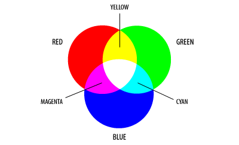

# CSS - Cascade Style Sheet

## ¿Qué es CSS y para qué sirve?

**CSS** significa **C**ascade **S**tyle **S**heets, "hojas de estilo en cascada" y nos permite crear reglas que definen propiedades visuales para nuestros elementos. Es el lenguaje con el que vamos a "estilar" los elementos que colocamos en el html.

El estilado con CSS se define como una serie de "reglas". Una regla de estilado se expresa en modo `propiedad: valor`, donde la propiedad puede ser alguna de las muchísimas que existen en CSS y los valores posibles dependerán de qué propiedad se trate.

Pero además de poner valor a las propiedades, tenemos que indicar a qué elemento(s) queremos que se aplique la o las reglas. A eso le llamamos "selector", que es la forma de indicar qué elementos _seleccionamos_ para aplicar esas reglas. Por último, al final de cada regla que se aplique se coloca un punto y coma. Entonces:

**Formato de código CSS:**
```css
selector {
  nombrepropiedad: valor;
}

/* y así ,entre barras y asteriscos, se escribe un comentario en css */
```

Por ejemplo, una regla muy sencilla es "color", que define el color del texto del elemento (si su contenido es texto). Y el selector más sencillo es el de tipo de elemento: simplemente el nombre de la etiqueta a la que queremos que se aplique.

**Ejemplo de código CSS:**
```css
span {
  color: red;
}
```

En el código de ejemplo definimos que todos los elementos `span` de nuestro documento deben tener la tipografía de color rojo.

En CSS todo el tiempo vamos a estar utilizando estos dos conceptos: 
* Seleccionar elementos
* Definir como queremos que se vean

**IMPORTANTE**: una herramienta muy útil a la hora de trabajar con CSS y JavaScript es la [vista de herramientas del desarrollador de Google Chrome](https://developers.google.com/web/tools/chrome-devtools), conocida como _DevTools_, que podemos abrir desde el menú de Chrome, con F12 o con la combinación Ctrl+Shift+I.


## Colores en CSS

Los colores en las pantallas están compuestos por 3 colores básicos: rojo, verde y azul. La combinación de esos tres colores se llama RGB por sus siglas en inglés (**R**ed, **G**reen y **B**lue).



Vamos a ver 4 formas de expresar un color en CSS.

### Colores por nombre

* Existen nombres de colores que podemos utilizar directamente y el browser sabe como mostrarlos
* La lista de colores que podemos utilizar no es muy extensa, lo cual nos limita a la hora de elegir un color
* El nombre del color es en inglés (ejemplo: white/blanco)
* Son fáciles de utilizar
* Ejemplos de colores por nombre son **white, silver, gray, black, red, blue, green, orange, pink, brown, yellow**, etc.

**Ejemplo:**
```css
body {
  color: black;
}

p {
  color: gray;
}

h2 {
  color: orange;
}
```

Pueden ver esta [lista de colores según versión de CSS](https://developer.mozilla.org/es/docs/Web/CSS/color_value)

### Mezcla RGB por valores decimales
* Para este color utilizamos la función de CSS llamada **rgb**
* Podemos asignar un valor entre 0 y 255 a cada color
* Si todos los valores son 0 obtenemos el color negro
* Si todos los valores son 255 obtenemos el color blanco
* El orden de los colores es el especificado en el nombre, es decir que el primer valor es para rojo, el segundo para verde y el tercero para azul
* El VSCode nos ofrece una forma de construir esta mezcla con una paleta cuando estamos editando reglas de color CSS en el editor para facilitarnos el trabajo.
* Ejemplos:
  * rojo puro: rgb(255, 0, 0)
  * verde puro: rgb(0, 255, 0)
  * azul puro: rgb(0, 0, 255)


**Ejemplo:**
```css
body {
  color: rgb(0, 0, 0);
}

p {
  color: rgb(0, 255, 0);
}
```

* Existe otra forma de utilizar rgb en CSS y es por medio de la función rgba() que agrega un canal más de transparencia (a = "alpha", el nombre habitual para el valor de transparencia)
* Podemos asignar un valor entre 0 y 1 para el nivel de transparencia, con decimales (separados por punto)
* Se asigna como cuarto parámetro de la función

**Ejemplo:**
```css
body {
  color: rgba(255, 0, 0, 1); /* rojo 100% visible */
}

p {
  color: rgba(255, 0, 0, 0.4); /* rojo semitransparente con 40% de opacidad */
}
```

### Mezcla RGB por valores hexadecimales

Otra forma es con la mezcla RGB, pero en lugar de utilizar la expresión "rgb" y poner las proporciones de la mezcla en valores decimales de 0 a 255, utilizamos un numeral (`#`) y expresamos la _cantidad_ de cada color en valor hexadecimal, que también se corresponde con valores de 0 a 255, pero en "base 16" (hexadecimal) se escriben 0 a FF (pueden usarse mayúsculas o minúsculas indistintamente). Ejemplos de conversión decimal-hexadecimal:

```
  0 = 0
  9 = 9
 10 = A
 15 = F
 16 = 10
 60 = 3C
255 = FF
```

Ejemplo:
```css
  h1 {
    color: #e31eb5;
  }
```

En ese ejemplo tenemos E3 (227 en decimal) para rojo, 1E (30) para verde y B5 (181) para azul, formando un magenta claro o fuccia. Sería equivalente a `rgb(227,30,181)`.

Un caso específico son los colores donde cada valor conste de 2 cifras iguales, en cuyo caso se puede simplificar y expresar toda la combinación en 3 cifras. Es decir que `#11ff99`, por ejemplo, se puede expresar como `#1f9`. Es muy típico verlo así cuando se trata de negro (`#000`) o blanco (`#fff`), por ejemplo.

Pueden ver más en [este link](http://www.blogoff.es/2008/11/19/colores-en-hexadecimal-una-introduccion/).

**Ejemplo:**
```css
body {
  color: #fff;
}
```

### HSL

Este sistema es el menos usado y hace referencia a **H**ue, **S**aturation, **I**ntensity, es decir tono, saturación e intensidad.

* Podemos establecer un valor entre 0 y 360 para el tono (hue) según el color que queremos:

* Tanto saturación como intensidad aceptan un valor que va de 0 a 100%
* Ejemplo: 
  * negro: hsl(0, 0%, 0%)
  * blanco: hsl(0, 0%, 100%)
  * rojo: hsl(0, 100%, 50%)

[Calculador de HSL](https://www.w3schools.com/colors/colors_hsl.asp)
[Más sobre HUE)](https://es.wikipedia.org/wiki/Tono_(color))
[Más sobre HSL](https://es.wikipedia.org/wiki/Modelo_de_color_HSL)
[Más sobre colores](https://desarrolloweb.com/articulos/1503.php)

* En este sistema también contramos la función con alpha que funciona de la misma manera que el rgba. Por ejemplo, un gris con transparencia sería `hsla(0, 100%, 100%, 0.5);`

## Dónde aplicar el código CSS

Existen 3 formas de aplicar estilado con CSS:

* Se puede aplicar **a nivel elemento** utilizando el atributo **style** en el elemento
* **A nivel documento** con el elemento `<style>` en el head
* **En un archivo de CSS separado**, vinculándolo con el elemento `<link>` desde todos los documentos donde lo queramos utilizar.

### Estilos a nivel elemento
* La forma más particular e individual que tenemos de utilizar css es utilizando el atributo **style** que tienen los elementos HTML
* Dentro del atributo style escribimos las propiedades visuales separadas por punto y coma

**Ejemplo:**
```html
<span style="color: white;">¡Texto en color rojo!</span>
```

* De esta forma establecemos que **un** elemento span en particular va a tener el color de texto blanco
* Si quiero que **dos** o más elementos tengan el mismo color lo hacemos de la siguiente manera:

**Ejemplo:**
```html
<span style="color: red;">¡Texto en color rojo!</span>
<span style="color: red;">¡Otro texto en color rojo!</span>
```

Claramente esto no nos sirve si tenemos que estilar muchos elementos. Esta es una buena opción cuando necesitamos que si o si un elemento se vea de una determinada forma, pero es la forma menos utilizada, porque nos mezcla mucho el código CSS con el HTML.

#### Práctica
[Ejercicio 1](../ejercicios/consignas/css/ej1.md)

### Estilos a nivel documento
* Por medio de la etiqueta `<style>` podemos definir los estilos que queremos para nuestros elementos a nivel documento
* Utilizando selectores podemos cambiar la forma que se ve uno o muchos elementos del mismo tipo
* Para definir que el texto que estamos escribiendo dentro de la etiqueta **style** es css, utilizamos el atributo **type** con el valor "text/css"
* Si bien podemos omitir este atributo ya que HTML5 no lo require dejamos en manos del browser como interpretar el contenido de esta etiqueta
* Para estar más seguro y lograr mejor compatibilidad con browsers anteriores definimos el atributo **type** del elemento **style**

**Ejemplo:**
```html
<!DOCTYPE html>
<html>
  <head>
    <title>Usando CSS</title>
    <style type="text/css">
      span {
        color: blue;
      }
    </style>
  </head>
  <body>
    <span>Texto de color</span>
    <span>Texto de color</span>
    <span>Texto de color</span>
  </body>
</html>
```

Con tan solo un cambio podemos establecer que todos nuestros elementos span se vean de otro color:

```html
<!DOCTYPE html>
<html>
  <head>
    <title>Usando CSS</title>
    <style type="text/css">
      span {
        color: red; /* ahora es rojo */
      }
    </style>
  </head>
  <body>
    <span>Texto de color</span>
    <span>Texto de color</span>
    <span>Texto de color</span>
  </body>
</html>
```

#### Práctica
[Ejercicio 2](../ejercicios/consignas/css/ej2.md)

Esta forma de utilizar los estilos es simple cuando necesitamos definir estilos para un documento, pero tiene la desventaja de agregarnos más líneas en el mismo archivo y sigue mezclándonos el css en el mismo archivo que el html, y cuando tengamos proyectos más grandes veremos que eso dificulta el trabajo.

### Agregar hoja de estilo en un documento externo (link)

Esta es la forma más utilizada, permitiéndonos separa el CSS del HTML. Utilizando la etiqueta **link** podemos vincular el CSS desde un archivo separado, y todas las reglas que definamos en ese CSS van a ser aplicadas en todos los documentos desde donde lo vinculemos.

* Esta es la mejor forma de unificar los estilos para nuestro sitio y es una forma más general de hacerlo
* La etiqueta **link** tiene los siguientes atributos y valores:
  * **href:** establece el path al documento CSS
  * **rel:** establece la relación con el otro documento y utilizamos el valor `"stylesheet"`

**Ejemplo:** 

Archivo `styles.css`
```css
span {
  color: red;
}
```

Archivo: `index.html`
```html
<!DOCTYPE html>
<html>
  <head>
    <title>Index</title>
    <link rel="stylesheet" href="styles.css" />
  </head>
  <body>
    <span>Texto de color</span>
    <span>Texto de color</span>
    <span>Texto de color</span>
  </body>
</html>
```

Archivo: contact.html
```html
<!DOCTYPE html>
<html>
  <head>
    <title>Contact</title>
    <link rel="stylesheet" href="styles.css" />
  </head>
  <body>
    <p>Acá también hay <span>Texto de color</span> </p>
    <p>Acá también hay <span>Texto de color</span> </p>
    <p>Acá también hay <span>Texto de color</span> </p>
  </body>
</html>
```

Con tan solo un cambio en la hoja de estilo podemos modificar todos los documentos vinculados.

#### Práctica
[Ejercicio 3](../ejercicios/consignas/css/ej3.md)

## Más características de CSS

* CSS se llama Hoja de estilo en cascada ya que los elementos pueden **heredar** propiedades visuales de padre a hijo
* Si establecemos estilos al **body** todos los elementos que esten en el documento van a heredar esos atributos
* No todos los elementos son heredables
* Una buena forma de ver esto es utilizando la barra de [developer tools](https://developer.chrome.com/devtools/docs/elements-styles)
* Los estilos que definimos en un archivo externos pueden ser sobrescritos utilizando la etiqueta **styles**
* Los estilos definidos en style pueden ser sobrescritos utilizando el atributo **style** de los elementos
* De esta forma podemos ver que utilizamos reglas generales que son "pisadas" (sobreescritas) por las más individuales
* Este mismo concepto se da entre elementos: si definimos atributos visuales para el **body** podemos sobrescribir cómo se ven los **párrafos**, por ejemplo, dejando que el resto de los elementos hereden las propiedades declaradas en el **body** (el párrafo es un elemento "hijo" del body por estar dentro)

**Ejemplo:** 

styles.css
```css
 p {
   color: red;
 }

 span {
   color: green;
 }
```

```html
<link href="styles.css" type="text/css" rel="stylesheet" />

<style type="text/css">
  p {
    color: blue;
  }
</style>

<p>Este texto se va a ver azul</p>
<p style="color: black;">Este texto se va a ver negro</p>
<p>Este también se va a ver azul, pero <span>el span va a ser verde</span> porque esa regla no fue "pisada"</p>
```

Como podemos ver en este ejemplo el estilo que establecemos en el elemento va a ser el que quede definido finalmente. El estilo definido en el documento (etiqueta style) pisa el que esta definido en el archivo general. En este caso importa el orden en que fueron llamados los estilos. Como regla podemos decir que siempre ponemos los estilos más generales primero y después sobrescribimos lo que necesitamos.

#### Práctica
[Ejercicio 4](../ejercicios/consignas/css/ej4.md)
