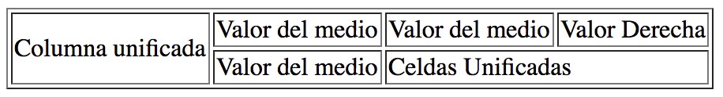
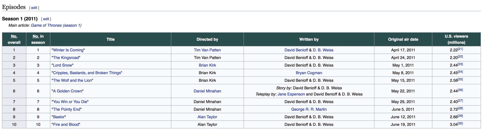
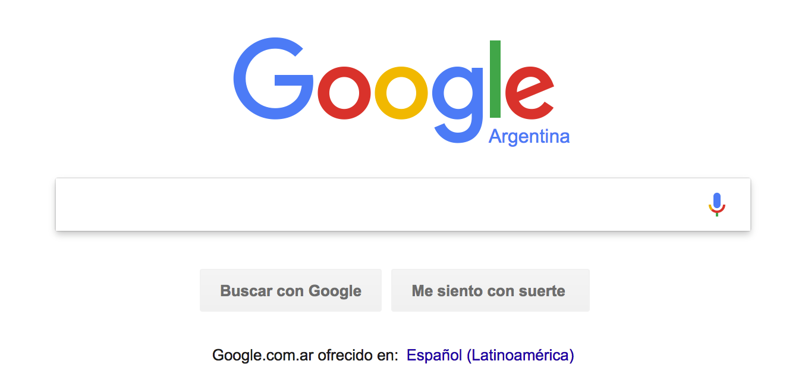
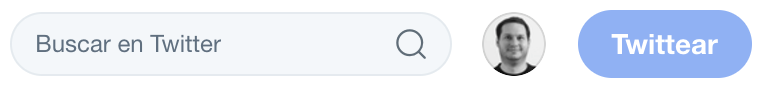
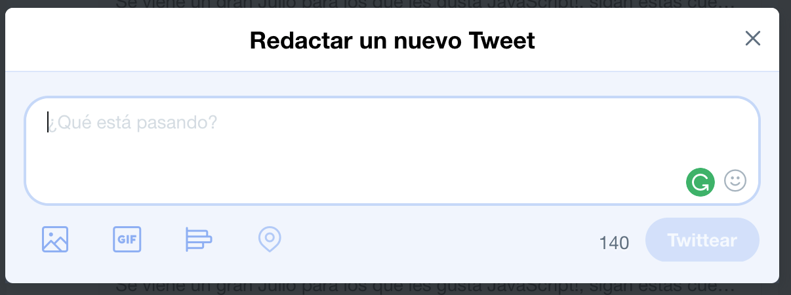
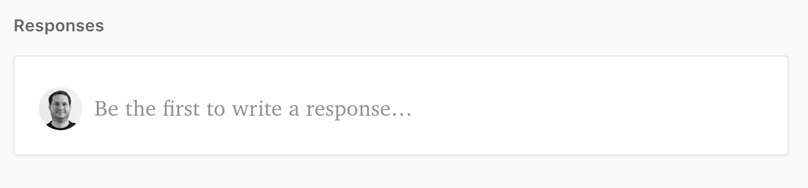
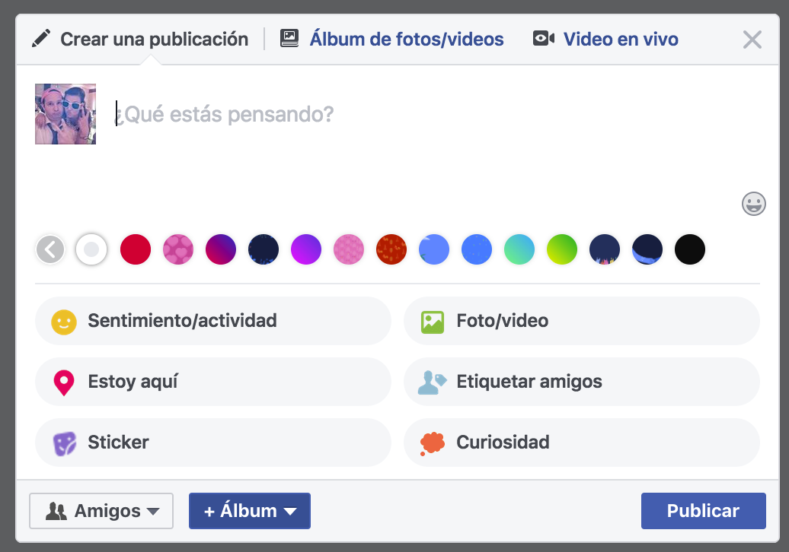

### Atributos de los elementos
* Los elementos en HTML pueden tener atributos que nos sirven para describirlo mejor, agregar funcionalidad o alterar su comportamiento.
* El atributo **id** nos permite identificar de forma única un elemento dentro del documento. (Sólo deberíamos tener un elemento de este tipo por documento, ejemplo: Un título principal con el id: titulo)
* El atributo class nos permite establecer a que clase de CSS pertenece un elemento. De esta forma podemos agrupar elementos por la forma que se ven o comportan. (Podemos utilizar la misma clase en varios elementos)

Ejemplo usando ID y class
```html
<tipoDeEtiqueta id="titulo-principal" class="rojo"></tipoDeEtiqueta>
```

## Hipervínculos
* Podemos vincular documentos utilizando hipervínculos
* La etiqueta **a** establece un nuevo vínculo
* Por medio del atributo **href** podemos vincular documentos
* El atributo **href** acepta una dirección absoluta, relativa o un email como valor y define de que tipo de hipervínculo es
* Entre la etiqueta de apertura y cierre ponemos el contenido del link
* Como contenido podemos poner una imágen y así generar otro efecto visual

**Ejemplo:**
```html
<a href="#">Contenido de mi link</a>
```

### Link externo
* Utilizando una ruta externa como atributo **href** podemos relacionar nuestro documento con un sitio exterior.

**Ejemplo:**
```html
<a href="http://google.com">Buscar</a>
```

### Links con rutas absolutas y relativas
* Para definir el atributo href podemos utilizar una ruta absoluta o relativa.
* Ruta absoluta se llama cuando utilizamos la ruta completa al documento. Puede ser local o de un sitio externo.

**Ejemplo:**
```html
<a href="http://yahoo.com">Abrir Yahoo</a>
<a href="c:\Usuarios\mi_nombre\mi_cv.pdf">Mirá mi CV</a>
```

* Podemos relacionar los documentos utilizando una ruta relativa.
* Este tipo de rutas está definida por la relación que tienen los documentos
* Podemos utlizar el concepto que utilizamos desde la consola para entrar y salir de una carpeta
* Para acceder a la raíz del sitio podemos utilizar **/**

**Ejemplo:**
```html
<a href="/">Volver a Home</a>
```

* Si tenemos 2 archivos que estan al mismo nivel podemos utilizar el nombre de los mismos como vínculo.


**Ejemplo:**
```html
En index.html:
<a href="about.html">Sobre Mi</a>

En about.html:
<a href="index.html">Sobre Mi</a>
```

* Podemos relacionar un archivo que esta dentro de una carpeta utilizando el nombre de la **carpeta/nombre del archivo**
* También podemos establecer relación desde el archivo que esta dentro de la carpeta con uno que esta afuera utilizando **../** tantas veces como niveles de profundidad que tenga que salir


**Ejemplo:**
```html
En index.html:
<a href="about/about.html">Sobre Mi</a>

En about/about.html:
<a href="../index.html">Sobre Mi</a>
```

### Atributo target
* Por medio del atributo **target** que tienen los hipervinculos y el valor **_blank** podemos establecer que queremos que ese documento se abra en una ventana nueva
* Los browsers actuales pueden abrir este documento en un tab nuevo si el browser lo soporta.

**Ejemplo:**
```html
<a href="http://comunidadit.org" target="_blank">Comunidad IT</a>
```

## Link de mail
* En el atributo **href** podemos establecer un tipo de valor especial **mailto** para decirle al browser que queremos abrir algún programa de envío de mail que esté instalado en el cliente
* Utilizamos el valor **mailto:dirección@gmail.com** para establecer cual es el mail que queremos utilizar

```html
<a href="mailto:pepe@gmail.com">Contacto</a>
```

### Punto de anclaje
* Utilizando el concepto de punto de anclaje podemos navegar a una sección del documento utilizando un link.
* Al utilizar un punto de anclaje el browser se sitúa en la posición donde encuentre dicho punto.
* Para esto utilizamos un elemento hipervínculo **a** con el atributo **name** que queremos utilizar como anclaje.

**Ejemplo**
```html
Definimos el anclaje en un documento
<a name="noticias"></a>

Desde el mismo documento podemos utilizar:
<a href="#noticias">Ir a la sección noticias</a>

Desde otro archivo:
<a href="archivo.html#noticias">Ir a la sección noticias</a>
```

#### Práctica
[Ejercicio 9](../ejercicios/consignas/html/ej09.md)

[Ejercicio 10](../ejercicios/consignas/html/ej10.md)

[Ejercicio 11](../ejercicios/consignas/html/ej11.md)

[Ejercicio 12](../ejercicios/consignas/html/ej12.md)

[Ejercicio 13](../ejercicios/consignas/html/ej13.md)

[Ejercicio 14](../ejercicios/consignas/html/ej14.md)

[Ejercicio 15](../ejercicios/consignas/html/ej15.md)

## Creando sitios:

### Medium
* Vamos a crear un sitio similar a [Medium](https://medium.com/) con todo lo que vimos hasta este momento.

#### Práctica
[Sitio 1](../ejercicios/consignas/html/sitio01/sitio01.md)


## Imagenes
* En HTML podemos utilizar la etiqueta **img** como contenedor de una imagen
* Dado que no tiene contenido es un tipo de etiqueta que tiene apertura y cierre en una sola etiqueta
* Para establecer el contenido del contenedor utilizamos el atributo **src** que significa source o fuente
* Esta etiqueta es un elemento en linea es decir que podemos poner uno al lado del otro
* Por defecto el contenedor va a tomar el tamaño original de la imagen
* Al trabajar en web siempre tratamos de optimizar las imagenes para que pesen lo menos posible
* Encontramos diferentes tipos de imagenes: [jpg](https://es.wikipedia.org/wiki/Joint_Photographic_Experts_Group), [png](https://es.wikipedia.org/wiki/Portable_Network_Graphics) y [gif](https://es.wikipedia.org/wiki/Graphics_Interchange_Format) entre otras
* [Optimización de la imagen - Developers Google](https://developers.google.com/web/fundamentals/performance/optimizing-content-efficiency/image-optimization?hl=es-419)

**Ejemplo**
```html

```

* En el atributo **src** acepta tanto rutas absolutas como relativas 

**Ejemplo**
```html
Imagenes con rutas relativas:


Salgo de una carpeta, entro a la carpeta imágenes y busco el archivo mifoto.jpg


Imagen con ruta absoluta:

```

* Utilizando los atributos **height** para la altura y **width** para el ancho podemos establecer el tamaño que queremos que tenga el contenedor. 
* Si no utilizamos bien las proporciones podemos hacer que la imagen se vea mal
* Podemos establecer un número como valor de estos atributos y la unidad de medida es en pixel

```html

```
* El atributo alt nos permite establecer un texto que describa la imagen.
* Este atributo lo utilizan los lectores de pantalla o es el mensaje que vemos cuando no se puede cargar la imagen
* Es una buena práctica describir nuestras imagenes con este atributo

**Ejemplo:**
```html

```

* También existe un atributo llamado **title** que nos permite agregar más información sobre la imagen
* Algunos browsers muestran un cartelito o tooltip al pasar el mouse sobre la imagen

**Ejemplo:**
```html

```

#### Práctica
[Ejercicio 16](../ejercicios/consignas/html/ej16.md)

### Foto con detalle
* Muchas veces necesitamos mostrar una imagen con un detalle, para esto HTML5 incorpora los elementos **figure** y **figcaption**
* Como contenido de **figure** podemos poner una imagen o más imagenes
* Utilizamos **figcaption** para establecer el detalle de la/s imagen/es
* Con varios de estos elementos podemos crear una especie de galería de imagenes
* Los browsers más viejos no saben renderizar estos elementos y simplemente muestran el contenido
* Para saber el nivel de soporte de HTML5 de nuestro browser podemos utilizar el siguiente [sitio](https://html5test.com)

**Ejemplo:**
```html
<figure>
  
  <figcaption>Programando como un campeón</figcaption>
</figure>
```

#### Práctica
[Ejercicio 17](../ejercicios/consignas/html/ej17.md)

## Tablas
* A la hora de mostrar datos tabulados podemos utilizar el concepto de tabla (ej: una grilla, comparar precios u horarios de servicios, etc)
* En HTML existe el elemento **table** que define una tabla
* En una tabla encontramos filas y columnas
* Para crear una fila utilizamos el elemento **tr** que significa **T**able **R**ow o fila de una tabla
* Las filas tienen como contenidos elementos del tipo celda **td** que significa **T**able **D**ata o dato de la tabla

**Ejemplo:**
```html
<table>
  <tr>
    <td>Primer Celda de la primer fila</td>
    <td>Segunda Celda de la primer fila</td>
  </tr>
  <tr>
    <td>Primer Celda de la segunda fila</td>
    <td>Segunda Celda de la segunda fila</td>
  </tr>
</table>
```

* En este ejemplo podemos ver que tenemos una tabla con 2 filas (tr) y cada fila tiene 2 celdas (td)
* En caso de tener una celda vacía, creamos el elemento **td** igual para que quede bien formada la tabla

#### Práctica
[Ejercicio 18](../ejercicios/consignas/html/ej18.md)

* Las tablas pueden tener 3 sectores definidos (thead, tbody y tfoot)
* El elemento **thead** define el encabezado de la tabla
* El elemento **tbody** define el cuerpo de la tabla
* El elemento **tfoot** define el pie de la tabla
* Podemos utilizar el elemento **th** para definir un table heading o encabezado de tabla
* El **th** funciona tanto como encabezado de una columna al igual que para una fila
* Es una buena práctica definir todas las secciones de una tabla
* Esto ayuda a los lectores de pantalla

**Ejemplo:**
```html
<table>
  <thead>
    <tr>
      <th>Desc. Columna 1</th>
      <th>Desc. Columna 1</th>
    </tr>
  </thead>
  <tbody>
    <tr>
      <td>Primer Celda de la primer fila</td>
      <td>Segunda Celda de la primer fila</td>
    </tr>
    <tr>
      <td>Primer Celda de la segunda fila</td>
      <td>Segunda Celda de la segunda fila</td>
    </tr>
  </tbody>
  <tfoot>
    <tr>
      <td>Primer Celda del pie</td>
      <td>Segunda Celda del pie</td>
    </tr>
  </tfoot>
</table>
```
#### Práctica
[Ejercicio 19](../ejercicios/consignas/html/ej19.md)

### Agregar atributos visuales
* Existen algunos atributos que nos permiten modificar la forma en que se ven las tablas
* Estos atributos son parte de las versiones anteriores de HTML pero siguen vigentes
* En el futuro vamos a utilizar **solo CSS** para decirle al browser como queremos que se vean nuestros elementos en general

* Para establecer que la tabla tiene que tener un borde utilizamos el atributo **border** y un valor numérico en pixeles que define el ancho del mismo
* También podemos establecer el color de fondo de nuestra tabla utilizando el atributo **bgcolor** y un [color web](https://es.wikipedia.org/wiki/Colores_web) como valor
* Las celdas también tiene el atributo **bgcolor** y de esta forma sobreescribimos el color de fondo de la tabla. Es decir que este atributo es más particular que el de la tabla.

**Ejemplo:**
```html
<table border="1" bgcolor="gray">
  <thead>
    <tr>
      <th>Encabezado 1</th>
      <th>Encabezado 1</th>
    </tr>
  </thead>
  <tbody>
    <tr>
      <td bgcolor="white">Contenido</td>
      <td>Contenido</td>
    </tr>
  </tbody>
  <tfoot>
    <tr>
      <td>Pie 1</td>
      <td>Pie 2</td>
    </tr>
  </tfoot>
</table>
```

#### Práctica
[Ejercicio 20](../ejercicios/consignas/html/ej20.md)


* Otro de los atributos que tienen las tablas nos permiten establecer cual es el ancho por medio del atributo **width** que acepta un valor numérico en pixeles
* Las celdas también tienen este atributo y al establecerlo condicionamos el tamaño del resto de la columna
* Con el atributo **cellpadding** podemos establecer el margen interior (como un aire) que tiene una celda, acepta un valor numérico en pixeles
* Para manejar el margen exterior de las celdas usamos el atributo **cellspacing** que acepta un valor numérico en pixeles

**Ejemplo:**
```html
<table width="800" cellpadding="10" cellspacing="10">
  <thead>
    <tr>
      <th width="100">Encabezado 1</th>
      <th>Encabezado 1</th>
    </tr>
  </thead>
  <tbody>
    <tr>
      <td>Contenido</td>
      <td>Contenido</td>
    </tr>
  </tbody>
  <tfoot>
    <tr>
      <td>Pie 1</td>
      <td>Pie 2</td>
    </tr>
  </tfoot>
</table>
```

#### Práctica
[Ejercicio 21](../ejercicios/consignas/html/ej21.md)

* Podemos unificar o unir celdas y columnas utilizando **rowspan** y **colspan**
* Ambos atributos aceptan un valor numérico con la cantidad de celdas o celdas de columna que queremos unificar
* Utilizamos **rowspan** para unificar columnas
* Por medio de **colspan** unificamos celdas

**Ejemplo:**
```html
<table>
  <tr>
    <td rowspan="2">Columna unificada</td>
    <td>Valor del medio</td>
    <td>Valor del medio</td>
    <td colspan="2">Celda unificada</td>
  </tr>
  <tr>
    <td>Valor del medio</td>
    <td>Valor del medio</td>
  </tr>
</table>
```



#### Práctica
[Ejercicio 22](../ejercicios/consignas/html/ej22.md)

#### Práctica extra
* Crear un nuevo archivo: got.html
* Reproducir el contenido de la siguiente imagen utilizando todo lo aprendido



* Para los links se puede utilizar el atributo href con el valor '#' para simular que esta vinculado con otro documento
* El color verde oscuro es: #2a4c4c
* El gris oscuro es: #e8eaef
* El gris claro es: #f7f9fa
* Para la tipografía en blanco pueden utilizar el siguiente código dentro del encabezado

**Ejemplo**
```html
  <table>
    <thead>
      <tr style="color:white;">
        <th>Contenido de color blanco</th>
      </tr>
    </thead>
  </table>
```

* Para ver la tabla origina pueden entrar al siguiente [link](https://en.wikipedia.org/wiki/List_of_Game_of_Thrones_episodes)

## Favicon
* Favicon es un icono que podemos establecer para mostrar en el tab del browser
* Tiene que estar en formato .ico, .gif o .png pero ico es el standard
* Se declara en el head de nuestro documento utilizando el tag **link** con el atributo **href** con el nombre del icono
* Por convención utilizamos el nombre **favicon.ico** o la extensión que estemos utilizando
* Se pueden definir más iconos para los distintos tipos de dispositivo

```html
  <head>
    <title>Mi sitio con Favicon</title>
    <link rel="shortcut icon" href="favicon.ico" type="image/x-icon">
  </head>
```

#### Práctica
[Sitio 2](../ejercicios/consignas/html/sitio02.md)

##  Formulario
* Los formularios son elementos que tienen campos que nos permiten obtener datos de usuarios y usuarias
* Podemos encontrarlos por todo internet en diferentes formatos:

**Buscadores:**

Google:


Twitter:


Youtube:


**Comentarios/posts:**

Twitter post:


Medium: 


Facebook: 


**Log in / sign up**

Facebook:


* Para definir un formulario utilizamos la etiqueta **form**
* Los formularios tienen 3 atributos importantes:
  * action: url a donde se van a enviar o submitear los datos del formulario
  * method: acepta como valor un método de HTTP para establecer la forma en que se van a enviar los datos: get o post 
    * Get: manda los datos por query string (en la url, ej: nombre=valor&apellido=valor)
    * Post: los datos viajan en el cuerpo del mensaje no se pueden ver
  * enctype: establece el tipo de media que vamos a enviar
    * Por defecto: 'application/x-www-form-urlencoded'
    * Para enviar archivos: 'multipart/form-data'
    * Texto plano: 'text/plain'

```html
<form action="guardar_usuarix.html" method="get" enctype="application/x-www-form-urlencoded" >
  Mi form
</form>
```

* El formulario va a tener un montón de elementos HTML que permitan ingresar datos, por ejemplo nombre de usuarix y contraseña
* Utilizando un botón vamos a ejecutar el formulario y enviar todos los datos a otro documento en el cual tenemos programado la forma de analizarlos y actuar en consecuencia
* Para recibir y utilizar los datos podemos utilizar varios lenguajes de programacion como C#, Java, JavaScript, PHP, Ruby, etc
* Cada campo de texto va a tener un nombre y de esta forma vamos a reconocer que tipo de dato es
* Al terminar de utilizar los datos enviamos un archivo de respuesta, por ejemplo al verificar el envío de credenciales válidas, le podemos mostrar la página que antes no podía

### Inputs
* Usando los **inputs** permitimos el ingreso o selección de datos
* Existen distintos tipos de inputs y cada uno de ellos tiene una funcionalidad distinta
* Por medio del atributo **type** definimos que tipo de campo es

#### Texto
* Se utilizan para ingresar una línea de texto como puede ser un nombre, apellido, email, dirección, etc
* Para definir este tipo de input utilizamos el **type** text
* Con el atributo **name** definimos el nombre de la variable

**Ejemplo:**
```html
<form>
  <input type="text" name="apellido" />
</form>
```

* Con el atributo **value** podemos definir el valor del contenido
* Se va a ver este texto pre ingresado en el campo de texto
* En caso de querer remplazarlo deberá borrar el valor actual y luego ingresar uno nuevo

**Ejemplo:**
```html
<input type="text" name="apellido" value="Sanchez" />
```

* Por medio del atributo **placeholder** podemos establecer un texto dentro del input a modo de ejemplo. Este texto no es el valor final del campo y solo lo utilizamos para ayudar al usuario o usuaria a entender qué tipo de valor debe ingresar
* Si utilizamos el atributo **value** y **placeholder** al mismo tiempo vamos a ver el valor asignado dentro del atributo **value**

**Ejemplo:**
```html
<input type="text" name="apellido" placeholder="Ej: Sanchez" />
```

* Existe un atributo **size** que nos permite establecer el tamaño del campo de texto
* Este atributo acepta un valor numérico con la cantidad de caracteres que queremos ver en el campo
* Este atributo solo limita la forma en que se ve el campo y no la cantidad de caracteres que puede ingresarse.
* Dado que es un atributo visual lo vamos a cambiar desde CSS en el futuro

**Ejemplo:**
```html
<input type="text" name="apellido" value="Sanchez" size="20" />
```

* Para limitar la cantidad de caracteres que puede ingresarse utilizamos el atributo **maxlength** que acepta un valor numérico con la cantidad máxima de caracteres esperados

**Ejemplo:**
```html
<input type="text" name="apellido" value="Sanchez" maxlength="20" />
```

#### Password
* Permite ingresar un password o contraseña
* Es como el campo de texto pero no se ven los caracteres ingresados
* Para definir este tipo de input utilizamos el **type** password
* Podemos utilizar los atributos **name**, **value**, **size** y **maxlength** al igual que los campos de texto
* Si bien el usuario o usuaria no puede ver los caracteres ingresados esto no significa que sea seguro ya que es solo un efecto visual
* Utilizamos HTTPS para enviar los datos de forma segura entre nuestro cliente al servidor

**Ejemplo:**
```html
<form>
  <input type="password" name="password" />
</form>
```

#### Submit buttons
* Permite enviar o submitear los datos del formulario a otro documento
* Para definir este tipo de input utilizamos el **type** submit
* Podemos utilizar el atributo name pero no es necesario ya que es tan solo un botón y no nos brinda ningún dato extra importante
* El atributo **value** acepta un texto y nos es útil para mostrar un mensaje al usuario o usuaria

**Ejemplo:**
```html
<form>
  <input type="submit" value="Crear usuarix" />
</form>
```

#### Práctica
[Ejercicio 23](../ejercicios/consignas/html/ej23.md)

[Ejercicio 24](../ejercicios/consignas/html/ej24.md)

#### Radio buttons
* Permite que se seleccione sólo un valor entre algunas opciones
* Para definir este tipo de input utilizamos el **type** radio
* Utilizamos el atributo **name** para identificar este elemento y luego obtener su valor
* Dado que este elemento se utiliza junto a otros iguales y la idea es que se seleccione uno solo, debemos nombrar a todos los elementos con el mismo **name**
* Para dar un contexto del valor de este elemento debemos escribir algún texto descriptivo junto a ellos

**Ejemplo**
```html
<form>
  Estado Civil: 
  <input type="radio" name="estadocivil" value="1" /> Casada/o
  <input type="radio" name="estadocivil" value="2" /> Soltera/o
</form>
```

* Podemos seleccionar inicialmente un radio button utilizando el atributo **checked** con el mismo valor **checked**
* Sólo un elemento radio button tiene que tener este valor ya que se utilizan para selección única como verdadero o falso

**Ejemplo**
```html
<form>
  Estado Civil: 
  <input type="radio" name="estadocivil" value="1" /> Casada/o
  <input type="radio" name="estadocivil" value="2" checked="checked" /> Soltera/o
</form>
```

#### Práctica
[Ejercicio 25](../ejercicios/consignas/html/ej25.md)

#### Checkboxes
* Permite que se seleccionen/deseleccionen múltiples valores entre algunas opciones.
* Para definir este tipo de input utilizamos el **type** checkbox.
* Utilizamos el atributo **name** para identificar este elemento.
* Dado que la selección es múltiple debemos utilizar el mismo **name** para todos los checkboxes de un mismo criterio (ejemplo: elegir super heroes que te gustan).
* Por medio del atributo **value** establecemos el valor de cada uno de estos elementos.
* El atributo **checked** nos permite activar o seleccionar inicialmente este elemento.

**Ejemplo**
```html
<form>
  Estado Civil: 
  <input type="checkbox" name="superheroe" value="batman" checked="checked" /> Batman
  <input type="checkbox" name="superheroe" value="superman" checked="checked" /> Superman
  <input type="checkbox" name="superheroe" value="flash" checked="checked" /> Flash
  <input type="checkbox" name="superheroe" value="mujer maravilla" checked="checked" /> Mujer Maravilla
</form>
```

#### Práctica
[Ejercicio 26](../ejercicios/consignas/html/ej26.md)

### Hidden
* En algunos casos podemos necesitar agregar algunos datos que no queremos que se vean en el formulario, para esto utilizamos inputs ocultos.
* Para definir este tipo de input utilizamos el **type** hidden.
* Utilizamos el atributo **name** para identificar este valor y el atributo **value** para establecer el valor del mismo.
* Si el usuario o usuaria ve el código fuente, sí puede ver estos campos y valores, ya que son parte del código de la página.
* Un caso de uso puede ser ocultar el id de un producto.

**Ejemplo:**
```html
<form>
  <input type="hidden" name="id-de-producto" value="20" />
</form>
```

#### Práctica
[Ejercicio 27](../ejercicios/consignas/html/ej27.md)

#### Image buttons
* Permite enviar o submitear los datos del formulario a otro documento utilizando una imagen
* Para definir este tipo de input utilizamos el **type** image
* Al igual que las imagenes este elemento tiene el atributo **src** que nos permite establecer cual es la fuente

**Ejemplo:**
```html
<form>
  <input type="image" src="crear_usuarix.png" />
</form>
```

* Podemos utilizar los atributos **height** y **width** para establecer el alto y ancho respectivamente
* Al ser un atributo visual, en el futuro, lo vamos a controlar desde CSS

#### Práctica
[Ejercicio 28](../ejercicios/consignas/html/ej28.md)

#### Campos especiales en HTML5
* HTML5 incorpora nuevos tipos de inputs
* Si el browser no soporta estos nuevos tipos de inputs, muestra un input de texto normal
* Todos ellos tienen el atributo **name** que nos permite identificar el valor ingresado (variable)

##### Date
* En muchos casos necesitamos pedirle al usuario o usuaria que ingrese una fecha, puede ser para saber su nacimiento, venciminto de la tarjeta de crédito, año en el que termino el colegio o para saber su experiencia laboral
* Para definir este tipo de input utilizamos el **type** date

**Ejemplo:**
```html
<form>
  <input type="date" name="fechadenacimiento" />
</form>
```

##### Email
* Este nuevo tipo de input permite que el usuario o usuaria ingrese su email o correo electrónico
* Para definir este tipo de input utilizamos el **type** email

**Ejemplo:**
```html
<form>
  <input type="email" name="email" />
</form>
```

##### URL
* Este nuevo tipo de input permite que el usuario o usuaria ingrese una url, por ejemplo puede ingresar la dirección de su sitio personal, trabajos realizados online o cuenta de twitter con la url completa.
* Para definir este tipo de input utilizamos el **type** url.

**Ejemplo:**
```html
<form>
  <input type="url" name="sitiopersonal" />
</form>
```

#### Práctica
[Ejercicio 29](../ejercicios/consignas/html/ej29.md)

##### Search
* Utilizando este nuevo tipo de input podemos pedirle al usuario o usuaria que ingrese un criterio por el cual vamos a realizar algún tipo de búsqueda.
* Para definir este tipo de input utilizamos el **type** search.
* Algunos browsers agregan la funcionalidad de borrar el contenido por medio de algún botón.
* Esta funcionalidad la podemos construir con CSS y JS sin problema.

**Ejemplo:**
```html
<form>
  <input type="search" name="busqueda" />
</form>
```

#### Práctica
[Ejercicio 30](../ejercicios/consignas/html/ej30.md)

#### File upload
* Permite seleccionar un archivo que será enviado con el resto de los datos del formulario
* Para definir este tipo de input utilizamos el **type** file
* Al utilizar este tipo de inputs debemos establecer el atributo **method** del formualrio en **post**
* Tambien debemos establecer el atributo del fomr **enctype** en 'multipart/form-data'
* Utilizamos el atributo name para identificar este archivo

**Ejemplo:**
```html
<form action="archivo.php" method="post" enctype="multipart/form-data">
  <input type="file" name="archivo" />
</form>
```

#### Práctica
[Ejercicio 31](../ejercicios/consignas/html/ej31.md)

### Text area
* Permite ingresar texto multilinea, se puede utilizar para notas, una bio o cualquier texto que ocupe más de una linea
* A diferencia del resto de las etiquetas el text area tiene contenido, es decir que tiene una etiqueta de apertura y una de cierre
* También utilizamos el atributo **name** para identificar a este elemento y obtener su valor

**Ejemplo:**
```html
<textarea name="bio">Rick Sanchez es un gran científico..</textarea>
```

* Podemos utilizar el atributo placeholder para establecer un valor inicial al igual que en el resto de los inputs

**Ejemplo:**
```html
<textarea name="bio" placeholder="Ingrese su bio"></textarea>
```

* Podemos limitar el ancho de este elemento por medio del atributo **cols** que acepta un valor numérico con la cantidad de caracteres que queremos ver
* También podemos cambiar la cantidad de lineas que muestra el textarea utilizando el atributo **rows** y acepta un valor numérico con la cantidad de líneas que queremos ver

**Ejemplo:**
```html
<textarea name="bio" cols="10" rows="2" >Texto inicial de mi text area</textarea>
```

#### Práctica
[Ejercicio 32](../ejercicios/consignas/html/ej32.md)

### Drop-down
* Permite seleccionar una o varias opciones de una lista
* Se utiliza cuando tenemos que mostrar muchas opciones
* Este elemento está compuesto de dos partes:
  * Etiqueta **select** para establecer que es un drop down
  * Etiquetas **option** para establecer las opciones y valores del **select**
* Identificamos el elemento **select** con el atributo **name**

**Ejemplo:**
```html
<form>
  <select name="opciones">
    <option>Opción 1</option>
    <option>Opción 2</option>
  </select>
</form>
```

* Establecemos el valor de la etiqueta **option** con el atributo **value**
* Por medio del atributo **selected** y el valor **selected** podemos seleccionar inicialmente un **option** dentro del **select**
* Si no utilizamos el atributo **selected** el drop down utiliza el primer elemento

**Ejemplo:**
```html
<form>
  <select name="paises">
    <option value="">Seleccione un país</option>
    <option value="arg">Argentina</option>
    <option value="bra">Brasil</option>
    <option value="chl">Chile</option>
    <option value="col" selected="selected">Colombia</option>
    <option value="ven">Venezuela</option>
  </select>
</form>
```

* Podemos transformar el **select** en un selector de múltiples valores utilizando el atributo **multiple** con el valor **multiple**
* Podemos establecer el atributo **size** con un valor numérico con la cantidad de elementos que queremos mostrar en la lista
* Para seleccionar múltiples opciones utilizamos la tecla **control**

**Ejemplo:**
```html
<form>
  <select name="paises" multiple="multiple" size="5">
    <option value="arg">Argentina</option>
    <option value="bra">Brasil</option>
    <option value="chl">Chile</option>
    <option value="col">Colombia</option>
    <option value="ven">Venezuela</option>
  </select>
</form>
```

#### Práctica
[Ejercicio 33](../ejercicios/consignas/html/ej33.md)

### Buttons
* También contamos con botones personalizados utilizando el elemento **button**
* Dado que podemos establecer el contenido de este elemento tenemos que utilizar la etiqueta de apertura y cierre

**Ejemplo:**
```html
<form>
  <button>+ Usuarix</button>
</form>
```

* Podemos agregar cualquier contenido, por ejemplo una imagen

**Ejemplo:**
```html
<form>
  <button>
    
    Usuarix
  </button>
</form>
```

### Describir elementos
* Para comunicarle al usuario o usuaria qué valor tiene que ingresar en cada campo podemos utilizar el elemento **label** o etiqueta.
* Estas etiquetas también nos permiten describirle el contenido de los campos a las personas no videntes.
* Este es un elemento en linea.

**Ejemplo:**
```html
<form>
  <label>Nombre:</label>
  <input type="text" name="nombre" />
  <label>Apellido:</label>
  <input type="text" name="apellido" />
</form>
```

* También se puede utilizar de la siguiente forma

**Ejemplo:**
```html
<form>
  <label>
    Nombre:
    <input type="text" name="nombre" />
  </label>
  <label>
    Apellido:
    <input type="text" name="apellido" />
  </label>
</form>
```

* La etiqueta **label** tiene un atributo **for** que acepta el nombre del id de un input.
* Si el **label** tiene establecido un atributo **for**, el usuario o usuaria puede hacer click en el texto del label para hacer foco en el input.

**Ejemplo:**
```html
<form>
  <label for="idnombre">Nombre:</label>
  <input type="text" name="nombre" id="idnombre" />
  <label for="idapellido">Apellido:</label>
  <input type="text" name="apellido" id="idapellido" />
</form>
```

### Agrupar campos
* Si el formulario es largo está bueno agrupar los campos por algún criterio, por ejemplo datos de la persona, de su casa, etc.
* Para agrupar campos utilizamos la etiqueta **fieldset**.

**Ejemplo:**
```html
<form>
  <fieldset>
    <label for="idnombre">Nombre:</label>
    <input type="text" name="nombre" id="idnombre" />
    <label for="idapellido">Apellido:</label>
    <input type="text" name="apellido" id="idapellido" />
  </fieldset>
</form>
```

* Podemos agregar un título a la sección utilizando la etiqueta **legend**

**Ejemplo:**
```html
<form>
  <fieldset>
    <legend>Datos de usuarix</legend>
    <label for="idnombre">Nombre:</label>
    <input type="text" name="nombre" id="idnombre" />
    <label for="idapellido">Apellido:</label>
    <input type="text" name="apellido" id="idapellido" />
  </fieldset>
</form>
```

#### Práctica
[Ejercicio 34](../ejercicios/consignas/html/ej34.md)

### Validar campos
* Es común tener que validar los datos ingresados para verificar que tengamos todo lo que necesitamos y en el formato correcto.
* Validar los formularios en el browser se conoce como validar los datos del lado del cliente.
* Para asegurarnos que los datos son correctos y que no nos interceptaron el request vamos a validar los datos también del lado sel servidor.
* Si bien la doble validación es más trabajo, hace que nuestro código sea más seguro.
* Por otro lado evita enviar datos al servidor que no esten bien y de esta forma ahorrar idas y vueltas entre cliente y servidor.
* HTML5 incorpora algunas funcionalidades que nos permiten validar nuestros formularios.
* Generalmente esta tarea se realiza utilizando JavaScript y lo vamos a ver más adelante.
* Por ahora no podemos customizar o personalizar el mensaje de error que muestran los campos (lo podemos hacer desde JavaScript).

#### Campos obligatorios
* Podemos hacer que un campo sea obligatorio utilizando el atributo **required**.
* Browserser más viejos necesitan que se agregue el valor **required**.
* El form no va a submitear los datos hasta que no este completo.

**Ejemplo:**
```html
<form>
  <input type="text" name="nombre" required />
  <input type="text" name="nombre" required="required" />
  <input type="submit" value="Registrar" />
</form>
```

#### Campos con el formato correcto
* Distintos tipos de datos necesitan cumplir con un formato para ser válidos por ejemplo un email, ruta o fecha
* Para validar el formato de un input podemos utilizar el atributo **pattern** y una [expresión regular](https://es.wikipedia.org/wiki/Expresi%C3%B3n_regular) como valor
* El campo no va a ser válido hasta que cumpla con el formato esperado
* Los nuevos campos de HTML5 como date, email y url ya vienen con una espresión regular incluída
* El elemento **textarea** no soporta este atributo

**Ejemplo:**
```html
<form>
  <input type="text" name="nombre" pattern="^[a-zA-Z]+$" placeholder="Ingrese sólo letras" /> 
  <input type="text" name="edad" pattern="\d+" placeholder="Ingrese sólo números" />
  <input type="submit" value="Registrar" />
</form>
```

* Para saber si podemos utilizar una feature nueva y entender que browsers la soportan podemos utilizar [caniuse.com](http://caniuse.com/#search=required) tanto para html, css o js
* Si quieren leer un poco más sobre este tema pueden entrar al sitio de [MDN](https://developer.mozilla.org/es/docs/Learn/HTML/Forms/Validacion_formulario_datos)

## Nuevas secciones de HTML5
* HTML5 es un cambio grande en la web ya que agrega/cambia etiquetas de HTML y agrega más funcionalidades (extraído de MDN)
  * **Semántica:** Permite describir con mayor precisión cual es su contenido.
  * **Conectividad:** Permite comunicarse con el servidor de formas nuevas e innovadoras.
  * **Sin conexión y almacenamiento:** Permite a las páginas web almacenar datos localmente en el lado del cliente y operar sin conexión de manera más eficiente.
  * **Multimedia:** Nos otorga un excelente soporte para utilizar contenido multimedia como lo son audio y video nativamente.
  * **Gráficos y efectos 2D/3D:** Proporciona una amplia gama de nuevas características que se ocupan de los gráficos en la web como lo son canvas 2D, WebGL, SVG, etc.
  * **Rendimiento e Integración:** Proporciona una mayor optimización de la velocidad y un mejor uso del hardware.
  * **Acceso al dispositivo:** Proporciona APIs para el uso de varios compomentes internos de entrada y salida de nuestro dispositivo.
  * **CSS3:** Nos ofrece una nueva gran variedad de opciones para hacer diseños más sofisticados.

* Dentro de la mejora de semántica encontramos nuevas etiquetas que nos permiten describir mejor el contenido de nuestros documentos
* Podemos definir mejor la estructura de nuestro sitio utilizando las etiquetas **header** (encabezado), **nav** (barra de navegación), **aside** (contenido en otra posición del documento), **footer** (pie de nuestro sitio)

**Ejemplo:**
```html
<body>
  <header>
    <h1>Encabezado de nuestro sitio</h1>
  </header>
  <nav>
    <ul>
      <li><a href="/">Home</a></li>
      <li><a href="bio.html">Bio</a></li>
    </ul>
  </nav>
  <aside>
    <p>Texto de la barra de costado del sitio</p>
  </aside>
  <section>
    <h2>Nueva sección de nuestro sitio</h2>
    <p>Contenido de nuestro sitio</p>
  </section>
  <footer>
    <p>Pie de nuestro sitio</p>
  </footer>
</body>
```

* Para describir un artículo, post o item de un foro podemos utilizar la etiqueta **article**
* Si queremos tener direcciónes del autor como contenido utilizamos la etiqueta **address**
* En caso de necesitar tener alguna fecha como contenido podemos utilizar la etiqueta **time**

**Ejemplo:**
```html
<body>
  <article>
    <p>Autor: Nombre del Autor</p>
    <time>Fecha de la publicación</time>
    <address>
      Datos sobre las direcciones del auto, tanto físicas como online
    </address>
  </article>
</body>
```

* Para más información podes leer la siguiente guía de [HTML5 en el MDN](https://developer.mozilla.org/es/docs/Sections_and_Outlines_of_an_HTML5_document)

#### Práctica
[Ejercicio 35](../ejercicios/consignas/html/ej35.md)

[Ejercicio 36](../ejercicios/consignas/html/ej36.md)

[Ejercicio 37](../ejercicios/consignas/html/ej37.md)

[Ejercicio 38](../ejercicios/consignas/html/ej38.md)

[Ejercicio 39](../ejercicios/consignas/html/ej39.md)

## Iframe
* La etiqueta **iframe** nos permite embeber un documento dentro de otro
* A diferencia el hipervínculo este elemento renderiza el contenido del documento en lugar de solo vincularlo
* El atributo **src** especifíca la ruta del documento que queremos embeber, esta ruta puede ser relativa o absoluta, interna o externa a nuestro sitio
* Con el atributo **height** podemos establecer el alto de la ventana y acepta un valor numérico
* Con el atributo **width** podemos establecer el ancho de la ventana y acepta un valor numérico

**Ejemplo:**
```html
<body>
  <iframe src="documento.html" height="200" width="200"></iframe>
</body>
```

* En HTML5 se incorpora el atributo **seamless** que le dice al browser que debe mostrar este iframe como si fuera contenido del documento donde está siendo embebido

**Ejemplo:**
```html
<body>
  <iframe src="documento.html" height="200" width="200" seamless></iframe>
  <iframe src="documento.html" height="200" width="200" seamless="seamless"></iframe>
</body>
```

#### Práctica
[Ejercicio 40](../ejercicios/consignas/html/ej40.md)

## Audio y video
* En la última versión de HTML se incorporan etiquetas para poder tener video y audio en nuestros documentos
* Existe todavía un problema con los [tipos de encoding que soporta cada browser](http://caniuse.com/#search=video)

* Para incorporar video utilizamos la etiqueta **video**
* No todos los browsers soportan el mismo formato de video
* Existen diferentes formatos que se pueden utilizar:
  * H264: Internet Explorer y Safari
  * WebM: Android, Chrome, Firefox y Opera
* Cada browser va a mostrar el reproductor de una forma particular y podemos controlarlo utilizando JavaScript
* Si el browser no soporta el tag **video** va a renderizar el contenido que esté entre la etiqueta de apertura y cierre

**Ejemplo:**
```html
<body>
  <video>
    <p>Este video es sobre..</p>
  </video>
</body>
```

* La etiqueta video tiene varios atributos que nos permite controlar la forma en la que funciona el reproductor
* Estos atributos funcionan como prendido/apagado, es decir que si figura el nombre del atributo el reproductor va a utilizar esa funcionalidad
  * **src:** especifíca la ruta al video
  * **width:** establece el ancho del reproductor en pixeles
  * **height:** establece el alto del reproductor en pixeles
  * **poster:** podemos establecer una imagen que se va a ver mientras se descarga el video o hasta que el usuario o usuaria haga click en el play.
  * **controls:** con este atributo le decimos al browser que utilice sus propios controles para este reproductor
  * **autoplay:** establecemos que el video tiene que comenzar automáticamente
  * **loop:** repite el video al finalizar
  * **preload:** permite establecer como se debe comportar el reproductor para cargar el video
    * **none:** no debe hacer nada hasta que el usuario o usuaria haga click en play
    * **auto:** el reproductor debe descargar el video ni bien se renderiza el documento
    * **metadata:** sólo descarga información sobre el video como puede ser el tamaño, duración, etc
* Para más información sobre los atributos de esta etiqueta podemos [leer la documentación](https://developer.mozilla.org/es/docs/Web/HTML/Elemento/video)
* [Guía de formatos](https://developer.mozilla.org/es/docs/Formatos_multimedia_admitidos_por_los_elementos_de_video_y_audio)

**Ejemplo:**
```html
<body>
  <video 
    src="ejemplo.mp4" 
    poster="ejemplo.jpg" 
    width="600" 
    height="400"
    controls
  >
    <p>Este video es sobre..</p>
  </video>
</body>
```

* Para soportar múltiples formatos podemos utilizar la etiqueta **source**
* Si utilizamos este tipo de elemento no vamos a utilizar el atributo **src** en el elemento video
* Este elemento soporta los siguientes atributos:
  * **src:** fuente del video
  * **type:** establece el tipo de video es así el browser sabe cual descargar
    * **codecs:** este atributo lo podemos poner dentro del atributo **type** para especificar que tipo de codec utilizamos para codificar el video

**Ejemplo:**
```html
<body>
  <video poster="ejemplo.jpg" controls>
    <source src="ejemplo.mp4" type="video/mp4">
    <source src="ejemplo.webm" type="video/webm"> 
    <source src="ejemplo.ogv" type="video/ogg"> 
    <source src="ejemplo.3gp" type="video/3gp">
    <p>Este video es sobre..</p>
  </video>
</body>
```

#### Práctica
[Ejercicio 41](../ejercicios/consignas/html/ej41.md)

* También podemos agregar audio a nuestros documentos
* Para incorporar audio utilizamos la etiqueta **audio**
* Funciona de manera similar que el elemento **video**
* Utiliza los siguientes atributos:
  * **src:** fuente del audio
  * **controls:** al igual que en video especifíca si el reproductor tiene controles
  * **autoplay:** el audio comienza automaticamente
  * **preload:** utiliza las mismas opciones que **video**
  * **loop:** nos permite repetir el audio
* Al igual que con los videos no todos los browsers soportan el mismo formato
  * **MP3:** Safari 5+, Chrome 6+ e IE9
  * **Ogg Vorbis:** Firefox 3.6, Chome 6, Opera 1.5 e IE9
* Al igual que con el video, si el browser no sabe renderizar la etiqueta audio va a mostrar el contenido de la misma

**Ejemplo:**
```html
<body>
  <audio src="ejemplo-audio.ogg" autoplay controls>
    <p>Este browser no soporta la etiqueta audio.</p>
  </audio>
</body>
```

* Al igual que los videos utiliza la etiqueta source
* Si utilizamos la etiqueta source no debemos especificar el atribtu **src** en la etiqueta audio

**Ejemplo:**
```html
<body>
  <audio autoplay controls>
    <source src="ejemplo-audio.mp3" />
    <source src="ejemplo-audio.ogg" />
    <p>Este browser no soporta la etiqueta audio.</p>
  </audio>
</body>
```

#### Práctica
[Ejercicio 42](../ejercicios/consignas/html/ej42.md)

## Metadata
* La etiqueta **meta** nos permite agregar metadata a nuestros documentos
* Vamos a crear estas etiquetas dentro del **head** de nuestro documento
* Este tipo de datos no son visibles pero ayudan a otros programas que leen nuestros documentos como pueden ser los bots de google, etc.
* Podemos establecer datos sobre el autor del documento, datos sobre el contenido para mostrar como resultado de busquedas, etc
* En este caso el atributo **name** tiene significado especial según el contenido. Hasta ahora este atributo tenía ese significado para nosotros y podíamos utilizar el contenido que queríamos. Ahora tenemos que usar nombres especiales asociados a una funcionalidad específica
* Lo mismo pasa con el atributo **content** que nos permite especificar el valor de una etiqueta **meta**

* Podemos establecer el tipo de codificación de caracteres que utiliza nuestro documento
* Esta etiqueta va debajo de la declaración del **head** del documento

**Ejemplo:**
```html
<head>
  <meta charset="UTF-8">
</head>
```

* Pueden leer más sobre [codificación de caracteres y como funciona](https://es.wikipedia.org/wiki/Codificaci%C3%B3n_de_caracteres)

* Para describir nuestro sitio utilizamos el atributo **name** con el valor **description** y el atributo **content** con el texto que queremos
* Esta bueno que la descripción no sea más larga que un twit (140 caractéres más o menos)
* Este texto lo utilizan los motores de búsqueda como google y lo muestra en los resultados como descripción de nuestro sitio

**Ejemplo:**
```html
<head>
  <meta name="description" content="Gran sitio sobre HTML5, CSS3 y JavaScript">
</head>
```

* También podemos asociar nuestro sitio/documento utilizando palabras clave
* Utilizamos el atributo **name** con el valor **keywords** y el atributo **content** con un listado de palabras separadas por comas como valor

**Ejemplo:**
```html
<head>
  <meta name="keywords" content="html, css, js, JavaScript, css3, css2, html4, html5" />
</head>
```

* Una buena práctica es describir quien es el autor del documento
* Utilizamos el atributo **name** con el valor **author** y el atributo **content** con el nombre del autor

**Ejemplo:**
```html
<head>
  <meta name="author" content="Rick Sanchez" />
</head>
```

## Caracteres especiales
* En HTML algunos caracteres tienen que estar codificados
* Si establecemos que el documento esta encodeado en UTF-8 podemos utilizar los caracteres especiales para los acentos, la letra ñ sin codificar ya que son parte del encoding
* Para ver un listado más completo de caracteres pueden visitar el siguiente [sitio](http://ascii.cl/es/codigos-html.htm)
* Utilizamos el caracter **&** para establecer que es un caracter especial

**Ejemplo:**
```html
<body>
  <p>&lt; Esto representa el caracter menor que (<)</p>
  <p>&gt; Esto representa el caracter mayor que (>)</p>
  <p>&amp; Esto representa el caracter ampersand (&)</p>
  <p>&copy; Esto representa el símbolo de Copyright</p>
  <p>&reg; Esto representa el símbolo de trademark registrado</p>
  <p>&trade; Esto representa el símbolo de trademark</p>
</body>
```

#### Práctica
[Ejercicio 43](../ejercicios/consignas/html/ej43.md)

## Extra:
[Specs de HTML5 - super técnico](https://dev.w3.org/html5/spec-preview/Overview.html)


