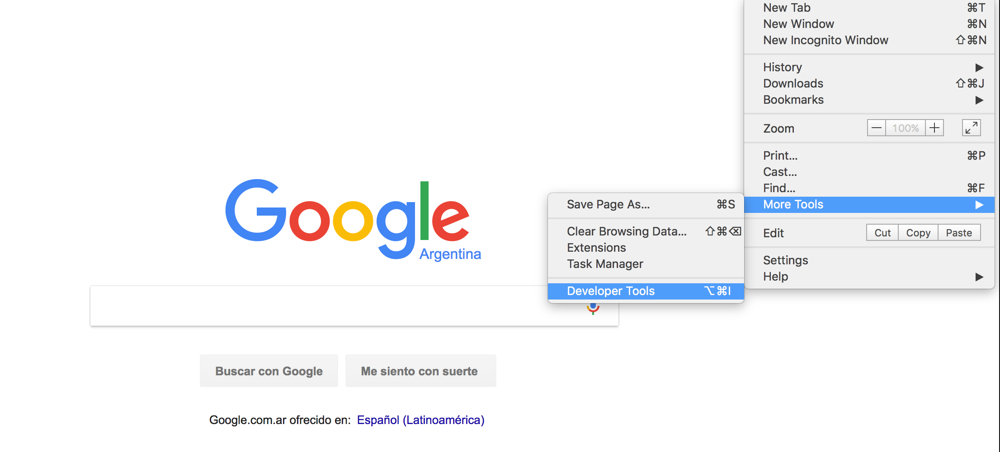
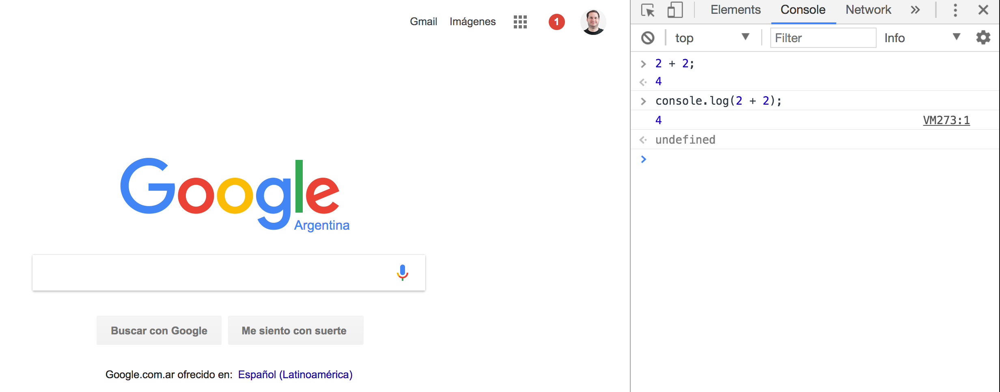

# JavaScript

## Definición

Javascript es un lenguaje de programación creado por [Brendan Eich](https://es.wikipedia.org/wiki/Brendan_Eich) en 1995 para la empresa Netscape, que en esos años producía un popular navegador. Es un lenguaje pensado para poder crear páginas web interactivas (modificar dinámicamente el contenido, usar botones, validar formularios, etc).


## Historia

Conocer la historia del lenguaje nos ayuda a entenderlo mejor. 

En 1993 nace el browser Mosaic creado por [NCSA (National Center for Supercomputing Applications)](http://www.ncsa.illinois.edu).

En 1994 [Netscape](http://isp.netscape.com) crea su propio browser, con el nombre de [Netscape Navigator](https://es.wikipedia.org/wiki/Netscape_Navigator), de mucho éxito en los años 90. Varios de los programadores de Mosaic se fueron a trabajar a Netscape.

En el año 1995 Netscape contrata a [Brendan Eich](https://brendaneich.com) con la promesa de que podía implementar el lenguaje [Scheme](https://es.wikipedia.org/wiki/Scheme) en el browser, lo cual no ocurrió.

En aquel momento Microsoft y Netscape competían para ver cuál de las dos empresas creaba el mejor browser posible. Netscape tenía la idea de crear un lenguaje que fuera fácil de aprender, que corriera en el browser y con el cual se pudieran crear páginas web interactivas.

Se le pidió a Brendan que creara un lenguaje cuya sintaxis (forma de escribir) sea similar a C++ y Java, que logre la mayor aceptación por parte de la comunidad pero lo suficientemente diferente para que sea algo distinto y que justifique su existencia. Durante el desarrollo se lo conoció como **Mocha**. Luego de tan solo 10 días de trabajo, Brendan logró la primer versión de este importante lenguaje y fué lanzado con el nombre de **LiveScript** con la versión Beta de Netscape 2.0 en Septiembre de 1995.

El lenguaje fue renombrado a **JavaScript** al publicar una nueva versión (2.0B3) del browser, como acción de marketing para montarse en la popularidad del lenguaje Java en ese momento. [Bill Joy](https://es.wikipedia.org/wiki/Bill_Joy), de Sun Microsystems, fue quien firmó el contrato por la marca. Esta decisión generó y sigue generando confusión en la comunidad ya que **Java y JavaScript son dos lenguajes completamente distintos**.

En Julio de 1996 Microsoft lanza el Internet Explorer 3, que tenía soporte para VBScript y JScript (una versión portada de JavaScript de Netscape). Dado que no era la misma implementación del lenguaje, los programas podían correr bien en un browser pero quizás no en el otro. Esto trajo un gran dolor de cabeza a lxs desarrolladorxs ya que no podían programar en un ambiente consistente. Este problema siguió con el lanzamiento de Internet Explorer 4. Dada la gran aceptación del browser de Microsoft (que se impuso por venir incluido en el sistema operativo Windows), se generaban versiones específicas de las páginas para cada navegador. El mayor costo que esto implicaba (programar lo mismo en dos lenguajes, uno para cada navegador) atentaba contra el uso de JavaScript.

Para evitar futuros problemas, en Noviembre de 1996 Netscape anunció que había propuesto a JavaScript para ser considerado por [ECMA International (European Computer Manufacturers Association)](http://www.ecma-international.org) como un standard de la industria. De allí nace la versión standard llamada **ECMAScript**.

### Versiones
* En Junio de 1997 ECMA International publicó la primer versión de la especificación llamada [ECMA-262](http://www.ecma-international.org/publications/standards/Ecma-262.htm).
* En Junio de 1998 se publicó la segunda versión con algunas modificaciones para cumplir con el standard ISO/IEC-16262. La tercer versión fue publicada en Diciembre de 1999.
* La 4ta versión de ECMAScript no se pudo terminar ni publicar dado que existían grandes diferencias de definiciones entre los contribuyentes del lenguaje como también una lista muy grande y ambiciosa de futuras mejoras o cambios.
* En Diciembre de 2009 se publicó la definición de la 5ta versión.
* En Junio de 2015 se lanzó la 6ta versión (popularizada como **ES6**)
* Cada año se publica una nueva versión con agregados menores (la última disponible es [ECMAScript 2020](https://262.ecma-international.org/11.0/), también referida como ES11)

Vamos a ver referencias a este lenguaje como ECMAScript, JavaScript, JS o por versiones específicas, como por ejemplo ES6 o ECMAScript 2015.

La especificación de ECMAScript™ fue y es desarrollada por un grupo denominado [ECMA TC39 (ECMA International Technical Committee 39)](http://www.ecma-international.org/memento/TC39.htm), que también cuentas de [Twitter](https://twitter.com/tc39) y su [gitHub](https://github.com/tc39), que incluye en su mayoría a [empleadxs de varias empresas y organizaciones](http://tc39wiki.calculist.org/about/people) interesadas en el crecimiento y desarrollo del lenguaje como pueden ser Mozilla, Google, Facebook, Apple, Twitter, Netflix o eBay, entre otras.

## Ambientes y Node.js
JavaScript nació con el objetivo de "correr" (ejecutarse) en el browser y agregar dinámica a páginas web. Las posibilidades del lenguaje crecieron ampliamente cuando se creó un entorno que le permitiera correr también fuera de un navegador: **Node.js**.

### Node.js

[Node.js](https://nodejs.org/es/) Es un entorno que permite ejecutar JavaScript fuera del navegador. Fue creado por [Ryan Dahl](https://es.wikipedia.org/wiki/Node.js) en el año 2009.

Durante esta etapa del curso vamos a utilizar esta herramienta para aprender los fundamentos del lenguaje y ver una introducción a la programación sin tener que utilizar el browser por el momento.

Para utilizar Node.js, el primer paso es instalarlo. Desde la web oficial podemos descargar el instalador. Veremos que en la web nos ofrece 2 versiones:
* La última versión "LTS". LTS significa Long Term Support (soporte a largo plazo), y son las versiones más estables y probadas. En el caso de Node, las versiones LTS son pares (10, 12, 14, etc.)
* La última versión "Current" o "Actual", que incorpora características nuevas pero que están en periodo de prueba (y que finalmente podrían no terminar formando parte de una versión estable -LTS-).

Vamos a instalar la versión LTS más reciente. Una vez instalada, vamos a ingresar a la consola de node. Esto lo podemos hacer de dos formas:

1. Buscar el ejecutable "node" de la instalación (en Windows, por ejemplo, lo vamos a encontrar en el menú Inicio).
2. Abrir una consola del sistema operativo (en el caso de Windows, cmd o PowerShell) y ejecutar en ella el comando "node":
```bash
node
```

En cualquier caso, vamos a ingresar a la consola de Node, que quedará en espera de comandos con un símbolo ">"

```bash
> _
```

Cuando vemos el símbolo **>** significa que abrimos la consola de Node.js llamada REPL, que nos permite escribir código en ECMAScript y ver el resultado.

REPL significa "Read-Evaluate-Print Loop", que podríamos traducir como "ciclo de lectura-evaluación-impresión", que es la lógica de funcionamiento de estas consolas: lee lo que escribimos, evalúa, responde y vuelve a empezar.

### Usando la consola de Node.js
Vamos a ejecutar una operación sumando dos valores:
* Abrir la consola
* Ejecutar el comando node
* Cuando veas el símbolo **>** escribir la siguiente sentencia

```javascript
2 + 2
```
* Presiona la tecla enter y deberías ver el siguiente resultado:

```javascript
> 2+2
4
>
```

* Presiona una vez las teclas CTRL + C y deberías ver el siguiente mensaje:

```bash
(To exit, press ^C again or type .exit)
```

* Presiona de nuevo las teclas CTRL + C para finalmente salir y ver la consola de tu sistema operativo en lugar de la de Node.js (no deberías ver más el símbolo >)

En este ejercicio lo que hicimos fue ejecutar una sentencia de ECMAScript en la consola de Node.js y como sabe interpretar este código nos pudo mostrar el resultado (4).

Si bien está muy bueno poder programar en la consola de Node.js podemos decir que no es muy práctico, y tampoco nos sirve para ejecutar código extenso.

Existe otra forma de ejecutar nuestro código de ECMAScript en Node.js y es por medio del uso de un archivo externo de la siguiente manera:

```bash
node progama.js
```

Al ejecutar este comando Node.js lee e interpreta el código ECMAScript que esta en el archivo llamado programa.js. Utilizamos la extensión `.js` para los archivos que estén programados en JavaScript / ECMAScript (ejemplo: ejercicio1.js, alumnos.js, etc).

### Usando Node.js con un archivo
* Crear una carpeta llamada js
* Crear un archivo de texto llamado `programa.js` dentro de la carpeta `js`
* Escribir el siguiente código dentro del archivo `programa.js` y salvarlo

```javascript
2 + 2
```

* Abrir la consola y posicionarse dentro de la carpeta `js`
* Ejecutar el siguiente comando

```bash
node progama.js
```

* Ver el resultado

Al ejecutar este programa no vemos ningún resultado y eso se debe a que Node.js está ejecutando la suma y no estamos mostrando el resultado en ningún lado. Podemos utilizar `console.log(valor a mostrar en consola)` para mostrar un valor en la consola. Modifiquemos el código del archivo `programa.js` para que se vea de la siguiente manera:

```js
console.log(2 + 2);
```

* Volvemos a ejecutar el siguiente comando:

```bash
node progama.js
```

* Si todo sale bien podemos ver el resultado esperado

### Usando la consola del Browser
* Abrir Chrome
* Abrir devtools
* Seleccionar el tab console dentro del devtools (es como la consola de Node.js pero dentro del browser)



* Escribir el siguiente código en la consola del devtools:

```javascript
2 + 2
```

```js
console.log(2 + 2);
```



* Utilizando la consola del browser obtenemos el mismo resultado que en Node.js. 
* Tanto Chrome como Node.js utilizan el mismo motor de JavaScript que se llama V8 y es mantenido por un equipo de Google.
* Podemos utilizar JavaScript tanto en el browser como con Node.js
* La consola del browser también es un REPL.

## Declaración de variables

* Al programar necesitamos almacenar valores en la memoria de la computadora para poder interactuar con ellos
* Para poder identificar estos valores le asignamos un nombre descriptivo
* Es posible que a lo largo de un programa pisemos un valor guardado en una posición de memoria, es decir que este valor puede ser **variable**
* Podemos decir que una **variable** es algo que nos permite almacenar un valor en memoria de la computadora y que por medio de un nombre descriptivo podemos acceder e interactuar con él. 

* En JavaScript existe la palabra reservada **let** que nos permite declarar una **variable**

**Ejemplo:**
```js
let variable;
```

* Si en nuestro programa vamos a necesitar el nombre y edad del usuario o usuaria podemos declarar las siguientes variables:

**Ejemplo:**
```js
let nombre;
let edad;
```

* Los nombres de las variables tienen que empezar con una letra
* Siempre será conveniente que el nombre de la variable tenga el mayor sentido posible considerando el uso que vamos a darle
* En programación existen distintos tipos de forma de escribir los nombres de las variables, en ECMAScript es común utilizar una forma que se denomina camelCase donde la primer letra de la primer palabra va en minúscula y luego cada palabra comienza con mayúscula. Otras formas de nomenclatura habituales (algunas de las cuales usaremos en el curso también), además de camelCase, son snake_case (separando palabras con guión bajo), kebab-case (separando con guión medio) y PascalCase (como camelCase pero con mayúscula inicial). También en algunos casos se utiliza TODO_EN_MAYUSCULAS. No usamos acentos ni caracteres especiales en los nombres de variables para evitar problemas potenciales de interpretación.

**Ejemplo:**
```js
let nombreDeMiVariable;
```

* En el ejemplo anterior vemos que declaramos una variable con el nombre de **nombre de mi variable** dado que los nombres de las variables no aceptan espacios utilizamos la denominación camel case para escribirlo: **nombreDeMiVariable**

#### Prácticas
[Ejercicio 1](../ejercicios/consignas/js/ej1.md)

## Operador de asignación

Una vez declarado el nombre de una variable podemos asignarle un valor. Esto se da ya que tenemos asignado un espacio en memoria donde podemos guardar un valor.

Por medio del operador de asignación **=** podemos asignar un valor a una variable

**Ejemplo:**
```js
let nombre;
nombre = 'Martín';
```

Podemos declarar todas las variables que necesitemos utilizar

**Ejemplo:**
```js
let nombre;
let edad;
nombre = 'Martín';
edad = 20;
```

#### Prácticas
[Ejercicio 2](../ejercicios/consignas/js/ej2.md)

También podemos declarar todas las variables en una línea y luego asignarle valores

**Ejemplo:**
```js
let nombre, edad;
nombre = 'Martín';
edad = 20;
```
#### Prácticas
[Ejercicio 3](../ejercicios/consignas/js/ej3.md)

Podemos declarar una variable y asignar un valor en la misma sentencia. A esto comunmente le llamamos "inicializar una variable".

**Ejemplo:**
```js
let nombre = 'Martín';
let edad = 20;
```

Todas las variables van a tener un valor, así que si no las inicializamos, van a crearse con un valor por defecto que en JavaScript será `undefined` (veremos más adelante de qué se trata).

#### Prácticas
[Ejercicio 4](../ejercicios/consignas/js/ej4.md)

* Utilizando `console.log()` podemos mostrar el valor de una variable en la consola

**Ejemplo:** Archivo **datos.js**
```js
let nombre = 'Martín';
let edad = 20;
console.log(nombre);
console.log(edad);
```

**Ejecutamos el programa datos.js utilizando Node.js**
```bash
node datos.js
```

#### Prácticas
[Ejercicio 5](../ejercicios/consignas/js/ej5.md)

* Vemos como salida los valores Martín y 20
* `console.log()` acepta varios valores separados por como para mostrar más de un valor en consola
* Podemos mostrar algo más significativo si escribimos lo mismo de la siguiente manera

**Ejemplo:** Archivo **datos.js**
```js
let nombre = 'Martín';
let edad = 20;
console.log('nombre: ', nombre);
console.log('edad: ', edad);
```

**Ejecutamos el programa datos.js utilizando Node.js**
```bash
node datos.js
```

* Al ejecutar este programa vemos una salida que nos explica mejor que es cada valor ya que vemos **nombre: Martín** y **edad: 20**
* Esta es una forma fácil de ver los valores de las variables y saber de donde viene

#### Prácticas
[Ejercicio 6](../ejercicios/consignas/js/ej6.md)

Si vemos código JavaScript es muy posible que observemos declaración de variables utilizando la palabra **var** (en lugar de **let**). Hasta la versión ES5, `var` era la forma de declarar variables, y si bien sigue funcionando por cuestiones de compatibilidad, las características de una declaración con `var` generaba algunos problemas y comportamientos inesperados en el código (básicamente debido al "alcance" de la variable, algo que veremos más adelante).

#### Constantes

* En programación existe un concepto de **constante** que significa que es una variable a la cual le asignamos un valor y no va a cambiar durante la ejecución del programa. De ahí su nombre de "constante".
* Desde ES6 (antes no existían las constantes en JS) podemos declarar una variable como **constante** utilizando la palabra reservada **const**

```js
const constante = valor;
```

#### Prácticas
[Ejercicio 8](../ejercicios/consignas/js/ej8.md)

* Obtenemos un error si cambiamos el valor asignado de una variable constante.

```js
const constante = valor;
constante = otroValor;
// Obtenemos un error de asignación: Assignment to constant variable.
```

#### Prácticas
[Ejercicio 9](../ejercicios/consignas/js/ej9.md)

## Tipos base
* Como vimos en los ejemplos anteriores existen distintos tipos de datos para representar distintos valores

**Ejemplo:**
```js
let nombre = 'Martín';
let edad = 20;

console.log('nombre: ', nombre);
console.log('edad: ', edad);
```

* En este ejemplo vemos que para el nombre estamos utilizando un valor entre `''` y para la edad estamos utilizando un número
* ECMAScript tiene los siguientes tipos base:
  * **string:** Los **string** también son conocidos como cadena de caracteres y no son más que un texto
  * **number:** El tipo de dato **number** son números y nos permiten hacer operaciones matemáticas
  * **boolean:** Este tipo **boolean** acepta valores del tipo **true** o **false**, es decir que podemos utilizarlo cuando necesitamos un valor **verdadero (true)** o **falso (false)**
  * **undefined:** Define que un valor es indefinido
  * **null:** Define que un valor es nulo, parece que es similar a undefined pero ya vamos a ver algunas diferencias
* A la hora de definir y asignar valores en nuestros programas vamos a tener que definir de que tipo de dato van a ser para saber que tipo de operaciones podemos hacer con ellos.
* Existen más tipos en ECMAScript y los vamos a ir viendo a lo largo del curso pero por ahora podemos arrancar con estos.

### String
* Los string representan un valor de texto, lo podemos utilizar para guardar valores como nombre, apellido, dirección, etc.
* Los valores del tipo string se escriben entre comillas dobles "" o simples ''
* Si bien es lo mismo utilizar cualquier tipo de comillas por una cuestión de convensión vamos a utilizar comillas simple ('') a lo largo del curso

**Ejemplo:**
```js
let nombre = 'Juan';
let apellido = "Perez";

console.log(nombre);
console.log(apellido);
```

* En este ejemplo declaramos dos variables (nombre y apellido) y le asignamos dos **valores del tipo string ('Juan', 'Perez')**
* Podemos utilizar este tipo de dato para un mensaje

**Ejemplo:**
```js
let mensaje = 'Bienvenidxs a ECMAScript!!!';
console.log(mensaje);
```

* No hace falta asignar los tipos de datos a una variable, podemos utilizarlos como literales de la siguiente forma

**Ejemplo:**
```js
console.log('Bienvenidxs a ECMAScript!!!');
```

* En este ejemplo utilizamos un **string o cadena de caracteres** en `console.log()` directamente

#### Prácticas
[Ejercicio 10](../ejercicios/consignas/js/ej10.md)
[Ejercicio 11](../ejercicios/consignas/js/ej11.md)

### Concatenar textos
* Utilizando el operador `+` podemos unir dos o más **strings**

**Ejemplo:**
```js
let nombre = 'Juan';
let espacio = ' ';
let apellido = 'Perez';

console.log(nombre + espacio + apellido);
```

* En este ejemplo vemos como podemos concatener o unir 3 variables del tipo string
* Podemos escribir este mismo ejemplo de la siguiente forma sin utilizar una variable para el espacio

**Ejemplo:**
```js
let nombre = 'Juan';
let apellido = 'Perez';

console.log(nombre + ' ' + apellido);
```

* Podemos ver en este ejemplo como utilizamos un valor literal para el espacio sin asignarlo a una variable

#### Prácticas
[Ejercicio 12](../ejercicios/consignas/js/ej12.md)
[Ejercicio 13](../ejercicios/consignas/js/ej13.md)
[Ejercicio 14](../ejercicios/consignas/js/ej14.md)

### Interpolación de textos
* En ES6 podemos utilizar una sintaxis para interpolar valores dentro de los strings. También encontraremos referencias a esto como "plantillas literales" o "string templates".
* Utilizamos las _comillas de acento grave_ (**``**, que no se usan en castellano pero sí en otros idiomas como francés o italiano) para establecer que es un texto donde vamos a interpolar un valor
* Por medio de `${variable}` establecemos cuál es el valor que queremos interpolar
* Para que se entienda mejor el concepto vamos a ver un ejemplo:

**Ejemplo:**
```js
let nombre = 'Pedro';
let template = `Bienvenidx ${nombre} a este sitio`

console.log(template);
```

* En este caso definimos la variable nombre con el valor de Pedro
* Creamos un template con el siguiente valor:
  * Texto Bienvenidx
  * Un _placeholder_ para el contenido de la variable nombre (**${variable}**)
  * Otro texto: a este sitio
* Cuando ECMAScript interpola los valores obtenemos el siguiente valor: `Bienvenidx Pedro a este sitio`
* Es decir que podemos crear un texto intercambiando uno o varios valores utilizando la función de interpolar textos de ES6

**Ejemplo:**
```js
let mama = 'Marta';
let papa = 'Martín';
let template = `Mi mamá se llama ${mama} y mi papá ${papa}`;

console.log(template);
```

* En este caso obtenemos el texto: Mi mamá se llama Marta y mi papá Martín
* Podemos obtener este mismo resultado utilizando concatenación de strings de la siguiente forma

**Ejemplo:**
```js
let mama = 'Marta';
let papa = 'Martín';
let mensaje = 'Mi mamá se llama '+ mama + ' y mi papá ' + papa;

console.log(mensaje);
```

* Utilizando ambas técnicas obtenemos el mismo resultado
* La interpolación de textos nos permiten hacerlo de una forma más simple y en formato de template 

#### Prácticas
[Ejercicio 15](../ejercicios/consignas/js/ej15.md)
[Ejercicio 16](../ejercicios/consignas/js/ej16.md)
[Ejercicio 17](../ejercicios/consignas/js/ej17.md)

### ¿Comillas dobles o simples?
* Como sabemos podemos utilizar comillas dobles o simples para definir un tipo de dato **string**
* En algunos casos vamos a necesitar utilizar estos símbolos como parte del valor

**Ejemplo:**
```js
let texto = 'Este texto tiene "comillas dobles"';
let otroTexto = "Este texto tiene 'comillas simples'";

console.log(texto);
console.log(otroTexto);
```

* Si necesitamos utilizar un tipo de comillas como parte de nuestro **string** podemos establecer el valor utilizando el otro tipo de comillas:
  * Si necesito utilizar comilla simple como contenido podemos definir el string utilizando comillas dobles
  * En caso de utilizar comilla doble como contenido definimos el string utilizando comillas simples

#### Prácticas
[Ejercicio 18](../ejercicios/consignas/js/ej18.md)
[Ejercicio 19](../ejercicios/consignas/js/ej19.md)

### Números
* Otro de los tipos de datos que tenemos en ECMAScript es **numbers** y nos permite utilizar números
* Este tipo de datos no va entre comillas ni dobles ni simples
* Para saber más sobre este tipo de datos pueden entrar en el [sitio de MDN](https://developer.mozilla.org/es/docs/Web/JavaScript/Referencia/Objetos_globales/Number)

**Ejemplo:**
```js
let edad = 38;
let volumen = 50;

console.log(edad);
console.log(volumen);
```

#### Prácticas
[Ejercicio 20](../ejercicios/consignas/js/ej20.md)
[Ejercicio 21](../ejercicios/consignas/js/ej21.md)

* Un error común que podemos hacer cuando arrancamos a programar o aprender ECMAScript es cofundirnos al encontrar algún código similar al siguiente ejemplo

**Ejemplo:**
```js
let edad = 38;
let volumen = "50";
```

> En este caso tenemos dos variables que contienen un número.
> A la variable **edad** le asignamos un tipo de dato **number** y a la variable **volumen** le estamos asignando un tipo de dato **string** por más que el contenido sea un número.
> Es importante entender que son distintos tipos de datos por lo cual vamos a poder utilizarlos de diferente forma, por ejemplo a los **numbers** los vamos a poder utilizar para operaciones matemáticas y a los **string** no.

* Más adelante vamos a utilizar operadores aritméticos para hacer operaciones matemáticas con este tipo de datos (suma, resta, multiplicación) 

### Métodos de Number
* Los tipos de datos **number** también tienen métodos que nos permiten obtener funcionalidades

### parseInt
* La función **parseInt** nos permite convertir un **string** a un tipo de dato **number** como número entero
* Retorna un número entero
* Podes saber más sobre esta función en el [sitio de MDN](https://developer.mozilla.org/es/docs/Web/JavaScript/Referencia/Objetos_globales/parseInt)

**Ejemplo:**
```js
const numeroComoTexto = '3';
const numero = parseInt(numeroComoTexto);
console.log(numero); // 3
```

**Ejemplo:**
```js
const numeroComoTexto = '3.20';
const numero = parseInt(numeroComoTexto);
console.log(numero); // 3
```

* Como podemos ver en este ejemplo podemos transformar un **string** a un **number** utilizando la función **parseInt** en caso de querer un número entero
* En caso de que el **string** tenga un número decimal al utilizar la función **parseInt** obtenemos un número entero (se pierde la parte decimal)

### parseFloat
* La función **parseFloat** nos permite cambiar de tipo de dato de un **string** a number
* Retorna un número decimal
* Podes saber más sobre esta función en el [sitio de MDN](https://developer.mozilla.org/es/docs/Web/JavaScript/Referencia/Objetos_globales/parseFloat)

**Ejemplo:**
```js
const piEnTexto = '3.14';
const pi = parseFloat(piEnTexto);
console.log(pi);
```

* Como podemos ver en este ejemplo podemos transformar un **string** a un **number** utilizando el método **parseFloat** en caso de querer un número decimal

### Convertir un número a string
* Podemos convertir un tipo de dato **number** a **string** utilizando el método **toString()**
* Retorna un string con el valor del número
* Podes saber más sobre este método en el [sitio de MDN](https://developer.mozilla.org/en-US/docs/Web/JavaScript/Reference/Global_Objects/Number/toString)

**Ejemplo:**
```js
let numero = 4;
let mensaje = numero.toString() + '2';
console.log(mensaje); // 42
```

* Podemos ver en este ejemplo como podemos transformar un tipo de dato **number** a **string**
* Obtenemos el resultado 42 ya que estamos concatenando 2 tipos de datos string

#### Prácticas
[Ejercicio 48](../ejercicios/consignas/js/ej48.md)


### Boolean
* Los tipos de datos boolean aceptan un valor del tipo true (verdadero) o false (falso)

**Ejemplo:**
```js
let encendido = true;
let puedeVotar = false;

console.log(encendido);
console.log(puedeVotar);
```

### Undefined
* Al declarar una variable en ECMAScript y no asignarle ningún valor por defecto se le asigna el valor **undefined**
* Este valor significa que algo no esta definido
* Podemos asignarlo como valor de la siguiente manera:

**Ejemplo:**
```js
let indefinido = undefined;
console.log(indefinido);
```

* Es común tener que validar si un valor es **undefined** y lo vamos a ver más adelante

#### Prácticas
[Ejercicio 23](../ejercicios/consignas/js/ej23.md)

### Null
* Existe un valor llamado **null** para establecer que algo es nulo
* Podemos asignarlo como valor de la siguiente manera:
* También es común tener que validar si un valor es **null**

**Ejemplo:**
```js
let nulo = null;
console.log(nulo);
```

#### Prácticas
[Ejercicio 24](../ejercicios/consignas/js/ej24.md)

* Si bien **null** y **undefined** parecen similares se utilizan de distinta manera

### typeof
* Por medio del operador **typeof** podemos saber de que tipo es una variable

**Ejemplo:**
```js
let nombre = 'Marta';
let edad = 30;
let casado = false;
let indefinido = undefined;
let nulo = null;

console.log(typeof nombre); // string
console.log(typeof edad); // number
console.log(typeof casado); // boolean
console.log(typeof indefinido); // undefined
console.log(typeof nulo); // object
```

* En este ejemplo vemos que cada tipo de dato retorna un tipo distinto
* En el caso de **null** retorna object en lugar de null como uno espera
* Object es otro tipo de dato de ECMAScript y lo vamos a ver más adelante

#### Prácticas
[Ejercicio 25](../ejercicios/consignas/js/ej25.md)
[Ejercicio 26](../ejercicios/consignas/js/ej26.md)

## Operadores aritméticos
* En ECMAScript existen operadores que nos van a permitir hacer operaciones ariméticas como pueden ser la suma, resta, multiplicación y división entre otros

### Suma
* Usando el operador `+` podemos sumar dos números o dos tipos de dato **number**

**Ejemplo:**
```js
2 + 2
```

* En este ejemplo estamos sumando dos valores de number literales

**Ejemplo:**
```js
const miEdad = 20;
const edadDeMiHermano = 15;
console.log(miEdad + edadDeMiHermano);
```

* Podemos sumar el valor que tienen asignado 2 o más variables

**Ejemplo:**
```js
const miEdad = 20;
const edadDeMiHermano = 15;
const resultado = miEdad + edadDeMiHermano;
console.log(resultado);
```

* También podemos utilizar una variable para guardar el resultado de sumar los valores de otras variables

### Resta
* Usando el operador `-` podemos restar dos números o dos tipos de dato **number**

**Ejemplo:**
```js
2 - 2; // Obtenemos 0 como resultado

const miEdad = 20;
const edadDeMiHermano = 15;

// Mostramos en consola el resultado de restar los valores de estas dos variables
console.log(miEdad - edadDeMiHermano);

// Utilizamos una variable para guardar el resultado de la operación
const resultado = miEdad - edadDeMiHermano;
console.log(miEdad - edadDeMiHermano);
```

* Podemos usar más de un operador:

**Ejemplo:**
```js
10 + 2 - 2; 

const miEdad = 20;
const edadDeMiHermano = 15;

// Podemos utilizar distintos operadores como también valores literales
console.log(miEdad - edadDeMiHermano + 10);

const resultado = miEdad - edadDeMiHermano + 10;

console.log('El resultado es: ' + resultado);
```

### Multiplicación
* Usando el operador `*` podemos multiplicar dos números o dos tipos de dato **number**

**Ejemplo:**
```js
2 * 2; // Obtenemos 4 como resultado

const numero1 = 10;
const numero2 = 5;

console.log(numero1 * numero2);

const resultado = numero1 * numero2;
console.log(resultado)
```

* Podemos utilizar paréntesis para establecer que operación queremos que se resuelva primero, esto tiene que ver con la precendecia de operadores.

**Ejemplo:**
```js
2 + 2 * 4; // 10
(2 + 2) * 4; // 16
```

* En este caso vemos que al utilizar paréntesis estabamos definiendo como queremos que se hagan las operaciones
* En el segundo ejemplo vemos que primero se va a resolver la suma de 2 + 2 y luego se va a multiplicar el resultado
* Este concepto también funciona con variables como es de esperar

**Ejemplo:**
```js
const dos = 2;
const cuatro = 4;

console.log(dos + dos * cuatro); // 10
console.log( (dos + dos) * cuatro ); // 16
```

### División
* Usando el operador `/` podemos dividir dos números o dos tipos de dato **number**

**Ejemplo:**
```js
20 / 2; // 10

const numero1 = 20;
const numero2 = 2;

console.log(numero1 / numero2); // 10

const resultado = numero1 / numero2;
console.log(resultado); // 10
```

* Dado que este código es una representación de una operación matemática tenemos que tener cuidado a la hora de dividir por 0
* ECMAScript obtenemos un valor del tipo **Infinity** al intentar dividir por 0
* Para saber más sobre este valor podes visitar el [sitio de MDN](https://developer.mozilla.org/es/docs/Web/JavaScript/Referencia/Objetos_globales/Infinity)

### Módulo o resto
* Usando el operador `%` podemos obtener el resto de dividir dos números o dos tipos de dato **number**

**Ejemplo:**
```js
20 % 2; // 0

const numero1 = 20;
const numero2 = 2;

console.log(numero1 % numero2); // 0

const resultado = numero1 % numero2;
console.log(resultado); // 0
```

* Este operador nos es útil por ejemplo si queremos saber si un número es par o no.

#### Prácticas
[Ejercicio 27](../ejercicios/consignas/js/ej27.md)
[Ejercicio 28](../ejercicios/consignas/js/ej28.md)
[Ejercicio 29](../ejercicios/consignas/js/ej29.md)
[Ejercicio 30](../ejercicios/consignas/js/ej30.md)
[Ejercicio 31](../ejercicios/consignas/js/ej31.md)
[Ejercicio 32](../ejercicios/consignas/js/ej32.md)


### Incremento y decremento
* Por medio de distintos operadores podemos hacer operaciones de una forma más simple a nivel código

#### Incrementar en 1
* Utilizando el operador `++` podemos incrementar un valor en 1

**Ejemeplo:**
```js
let numero = 0;
numero++;
console.log(numero); // 1
```

* También podemos establecer que primero queremos incrementar la variable para luego utilizarla cambiando el lugar del operador

**Ejemplo:**
```js
let numero = 0;
++numero;
console.log(numero); // 1
```

* En este caso parece ser lo mismo pero se pueden dar situaciones donde no lo sea

#### Restar un número
* Utilizando el operador `--` podemos reducir un valor en 1
* Al igual que en el incremento el operador puede ir delante o después del valor según el resultado esperado

**Ejemplo:**
```js
let numero = 10;

--numero;
console.log(numero); // 9

numero--;
console.log(numero); // 8
```

#### Hacer una operación sobre un mismo valor
* Al definir una variable podemos asignarle un valor como ya vimos
* Podemos reutilizar esa variable para asignarle otro valor
* También podemos utilizar la variable para usar el valor y luego asignarlo de nuevo a la misma variable
* Vamos a ver un ejemplo:

**Ejemplo:**
```js
let numero = 1;
numero = numero + 1
```

* Como vimos podemos usar el operador `++` para conseguir el mismo resultado
**Ejemplo:**
```js
let numero = 1;
numero++;
```

* Es decir que en este caso se incrementa y asigna el valor de la variable numero
* Este operador es súper útil pero sólo nos permite operar con la suma y con un valor de 1
* Existen distintos operadores que nos permiten hacer operaciones sobre un valor y asignar el resultado a la misma variable escribiendo menos código
* Los operadores son:
  * `+=` para la suma
  * `-=` para la resta
  * `*=` para la multiplicación
  * `/=` para la división
* Este concepto se entiende mejor desde código

**Ejemplo:**
```js
let numero = 1;

numero +=
console.log(numero); // 2
```

**Ejemplo:**
```js
let numero = 1;

numero = numero + 10;
console.log(numero); // 11
```

* También puedo hacer esta operación de la siguiente forma

**Ejemplo:**
```js
let numero = 1;

numero += 10;
console.log(numero); // 11
```

* Vemos que podemos sumar el valor 10 al valor que tiene la variable numero y asignar el resultado a la misma variable utilizando sólo el operador `+=`
* Podemos hacer esto con el resto de los operadores

**Ejemplo:**
```js
let numero = 10;

numero -= 2;
console.log(numero); // 8
```

**Ejemplo:**
```js
let numero = 10;

numero *= 2;
console.log(numero); // 20
```

**Ejemplo:**
```js
let numero = 20;

numero /= 2;
console.log(numero); // 10
```

* El concepto es siempre el mismo y lo que cambia es la operación realizada

#### Práctica
[Ejercicio 33](../ejercicios/consignas/js/ej33.md)


## Operadores de comparación simple y estricta

### Comparación Simple
* Podemos comparar dos valores utilizando el operador `==` y obtener un valor **boolean** como resultado.
* Este tipo de comparación se conoce como comparación simple ya que sólo compara si un valor es igual a otro
* Al comparar 2 valores de distintos tipos podemos obtener que son el mismo valor sin importar que sean diferente tipo (ejemplo: comparar un string con un número)
* Si los valores son iguales obtenemos **true**
* En caso de que los valores sean distintos obtenemos el valor **false**

**Ejemplo:**
```js
let numero1 = 20;
let numero2 = 20;
let numero3 = 10;

console.log(numero1 == numero2); //true
console.log(numero1 == numero3); //false
```

* Comparamos sólo valores:

**Ejemplo:**
```js
console.log(10 == '10'); //true
```

* Ya que podemos comparar dos valores y saber si son iguales también podemos saber si son distintos utilizando el operador `!=`

**Ejemplo:**
```js
let numero1 = 20;
let numero2 = 20;
let numero3 = 10;

console.log(numero1 != numero2); // false
console.log(numero1 != numero3); // true
```

* Otra forma de comparar valores es saber si un valor es más grande que otro
* Utilizamos el operador `>` para saber si el valor de la izquierda del operador es más grande que el valor de la derecha

**Ejemplo:**
```js
let numero1 = 20;
let numero2 = 10;

console.log(numero1 > numero2); // true
```

* También podemos saber si un valor es más chico que otro utilizando el operador <

**Ejemplo:**
```js
let numero1 = 20;
let numero2 = 10;

console.log(numero2 < numero1); // true
```

* En algunos casos necesitamos saber si un valor es más grande o igual que otro
* Es decir que esta condición se va a transformar en verdadera en caso de que el valor de la izquierda sea más grande o el mismo valor que el de la derecha

**Ejemplo:**
```js
let numero1 = 20;
let numero2 = 10;
let numero3 = 20;

console.log(numero1 >= numero2); // true
console.log(numero1 >= numero3); // true
```

* Podemos hacer lo mismo para saber si es menor

**Ejemplo:**
```js
let numero1 = 20;
let numero2 = 10;
let numero3 = 10;

console.log(numero2 <= numero1); // true
console.log(numero2 <= numero3); // true
```

### Comparación Estrícta
* La comparación estricta no solo compara el valor sino también el tipo de dato
* Utilizamos el operador `===` para comparar si son el mismo tipo de dato y valor
* Utilizamos el operador `!==` para comparar si son el distintos tipo de dato y valor

**Ejemplo:**
```js
console.log(10 === '10'); // false
console.log(10 !== '10'); // true
console.log(10 !== '10'); // true
```

* Los dos últimos casos da **true** ya que no importa el valor que tengan ambos valores son distintos tipo de dato

#### Práctica
[Ejercicio 34](../ejercicios/consignas/js/ej34.md)
[Ejercicio 35](../ejercicios/consignas/js/ej35.md)

## Operadores lógicos
* Existen operadores lógicos que nos permiten anidar condicionales
* Puedo saber si dos conciones son **true** utilizando el operador `&&` conocido como **and** o en español como **Y**
* Por ejemplo si queremos saber si el la edad del usuario o usuaria es mayor de 18 años y si el password es el esperado lo podemos hacer de la siguiente manera
* Para que este operador retorne **true** ambas condiciones deben ser verdaderas

**Ejemplo**
```js
let edad = 20;
let password = 'js1234';
let resultado = edad >= 18 && password ==='js1234';
console.log('resultado: ', resultado); // true
```

* En este ejemplo obtenemos un valor de true ya que ambas condiciones (edad >= 18 y password === 'js1234') son verdaderas
* Existe el operador `||` conocido como **or** u **O** en español que nos permite preguntar si al menos una de 2 condiciones es verdadera.
* Si la primer condición es verdadera ya no evalúa la segunda ya que al menos una de las dos condiciones es verdadera
* Caso de que la primer condición no sea verdadera va a comprobar si la segunda lo es
* Si ninguna de las dos condiciones es verdadera retorna falso
* Este operador retorna **true** si al menos una de las condiciones es verdadera

**Ejemplo**
```js
let edad = 20;
let password = 'js12345';
let resultado = edad >= 18 || password ==='js1234';
console.log('resultado: ', resultado); // true
```

* En este caso la condición es verdadera ya que la edad es mayor a 18 y no importa si el password es igual o no

**Ejemplo**
```js
let edad = 10;
let password = 'js1234';
let resultado = edad >= 18 || password ==='js1234';
console.log('resultado: ', resultado); // true
```

* En este caso el resultado es **true** ya que la edad no es mayor de 18 pero el password es correcto

**Ejemplo**
```js
let edad = 10;
let password = 'js12345';
let resultado = edad >= 18 || password ==='js1234';
console.log('resultado: ', resultado); // false
```

* En este caso la condición es **false** ya que ambas condiciones son falsas

## Negación
* Por medio del operador `!` podemos negar una condición
* Si tenemos un valor **true** negado obtenemos un valor **false**
* Si tenemos un valor **false** negado obtenemos un valor **true**

**Ejemplo**
```js
console.log(!true); // false
console.log(!false); // true
```

* Por ejemplo podemos utilizar la negación en el siguiente caso:

**Ejemplo**
```js
let edad = 21;
let resultado = edad < 18; 
console.log('¿La/el usuarix es mayor de edad?: ', !resultado); // la condición es false pero al negarla pasa a ser verdadera
```

#### Práctica
[Ejercicio 36](../ejercicios/consignas/js/ej36.md)
[Ejercicio 37](../ejercicios/consignas/js/ej37.md)

## Caracteres especiales en strings
* Existen caracteres especiales en los **strings** que agregan un valor extra
* \n  Nueva Línea
* \t  Tabulador
* \r  Retorno de Línea

**Ejemplo:**
```js
let mensaje = 'este texto \n es multilínea';
console.log(mensaje); // texto en 2 líneas

mensaje = '\t \t texto tabulado';
console.log(mensaje); // texto tabulado
```

* Por medio de los siguientes caracteres podemos escapar algunos caracteres:
* \'  Apóstrofe o comilla sencilla
* \"  Comilla doble
* \\  Carácter Backslash

**Ejemplo:**
```js
let mensaje = 'este texto \\no es multilínea';
console.log(mensaje); // muestra el caracter \ como parte del texto

// si no escapamos el caracter \ el texto es multiliena en lugar de tener \ como parte del contenido
mensaje = 'este texto \no es multilínea';
console.log(mensaje);
```

* Vemos que por medio de estos caracteres especiales podemos jugar con nuestros strings y prevenir errores o comportamientos inesperados!!

#### Práctica
* Abrir la consola de node o browser y probar estos ejemplos

## Propiedades y métodos de string
### Propiedad length
* Por medio de la propiedad length podemos saber cuántos caracteres tiene un **string**
* La propiedad **length** retorna o devuelve un número con la cantidad de caracteres que tiene el texto
* Lo utilizamos de la siguiente manera:

**Ejemplo:**
```js
let texto = '¡¡Bienvenidxs a ECMAScript!!';
let cantidadDeCaracteres = texto.length;

console.log(cantidadDeCaracteres);
```

* En este ejemplo declaramos una variable `texto` con el valor `¡¡Bienvenidxs a ECMAScript!!` y otra variable `cantidadDeCaracteres` donde guardamos la cantidad de caracteres que tiene la variable `texto`
* También podemos obtener el mismo resultado sin utilizar la variable `cantidadDeCaracteres`

**Ejemplo:**
```js
let texto = '¡¡Bienvenidxs a ECMAScript!!';
console.log(texto.length);
```

#### Práctica
[Ejercicio 38](../ejercicios/consignas/js/ej38.md)
[Ejercicio 39](../ejercicios/consignas/js/ej39.md)

### Métodos de String
* Los métodos nos permiten obtener funcionalidad para los distintos tipos de datos
* Este método retorna un nuevo string con el texto concatenado
* Podemos ver una lista de métodos del tipo String en el [sitio de MDN](https://developer.mozilla.org/es/docs/Web/JavaScript/Referencia/Objetos_globales/String)
* Vamos a ver algunos de los métodos más conocidos y jugar un poco con ellos

**Ejemeplo:**
```js
let variableString = 'valor de nuestro string';

// Al tener un valor del tipo string podemos llamar a un método utilizando un punto (como con la propiedad length) y paréntesis ()
variableString.metodo();

// También podemos pasar un valor a los métodos para lograr una funcionalidad específica
variableString.metodo(valor);
```

### Concat
* Hasta ahora vimos que podemos utilizar el símbolo + para concatenar 2 valores
* Los strings tienen un método llamado **concat** que nos permite concatenar valores
* Podes saber más sobre este método en el [sitio de MDN](https://developer.mozilla.org/es/docs/Web/JavaScript/Referencia/Objetos_globales/String/concat)

**Ejemplo:**
```js
let texto = 'Hola ';
let nombre = 'Marta';

// Concatenamos los strings usando el método concat
let mensaje = texto.concat(nombre);

console.log(mensaje);
```

* En este ejemplo se imprime el texto **Hola Marta**
* También se pueden pasar múltiples valores a ser concatenados

**Ejemplo:**
```js
let texto = 'ECMA';
console.log(texto.concat('Script', ' es lo mejor', ' del mundo de la programación'));
```
* en este ejemplo concatenemos varios strings al contenido de la variable texto
* Se muestra en pantalla el mensaje: **ECMAScript es lo mejor del mundo de la programación**;

#### Prácticas
[Ejercicio 40](../ejercicios/consignas/js/ej40.md)

### Mayúsculas y minúsculas
* Podemos transformar un texto a mayúscula o minúscula utilizando los métodos **toUpperCase** y **toLowerCase** respectivamente

**Ejemplo:**
```js
let textoEnMayuscula = 'HOLA';
let textoEnMinuscula = 'amigos';

console.log(textoEnMayuscula.toLowerCase()); // muestra el texto hola
console.log(textoEnMinuscula.toUpperCase()); // muestra el texto AMIGOS

console.log(textoEnMayuscula); // muestra el texto HOLA
console.log(textoEnMinuscula); // muestra el texto amigos
```
#### Prácticas
[Ejercicio 41](../ejercicios/consignas/js/ej41.md)
[Ejercicio 42](../ejercicios/consignas/js/ej42.md)

### Caracteres y posiciones
* Por medio del método **charAt** podemos saber que caracter se encuentra en una determinada posición de un string
* Este método acepta un valor numérico como parámetro
* El primer caracter esta ubicado en la posición 0
* Para saber cual es el último caracter podemos utilizar la propiedad **length**
* Dado que el primer elemento arranca en 0 a la logitud del string debemos restarle uno

**Ejemplo:**
```js
let textoSuperLargo = 'Este texto es bien largo así podemos saber varias cosas de él.';
let primerCaracter = textoSuperLargo.charAt(0);
let posicionDelUltimoCaracter = textoSuperLargo.length - 1;
let ultimoCaracter = textoSuperLargo.charAt(posicionDelUltimoCaracter);

// Accedemos al primer caracter E
console.log(primerCaracter);
console.log(ultimoCaracter);
```

#### Prácticas
[Ejercicio 43](../ejercicios/consignas/js/ej43.md)
[Ejercicio 44](../ejercicios/consignas/js/ej44.md)

### Recortando strings
* Utilizando el método **slice** podemos obtener una parte de un string
* Este método acepta dos parámetros slice(inicio, fin)
* Utilizamos indice desde 0 para obtener desde el inicio de la cadena

***Ejemplo:**
```js
let texto = 'Me encanta JavaScript!!';
let resultado = texto.slice(11, 21);
console.log(resultado); // JavaScript
```

* Si contamos desde la primer letra tenemos 11 caracteres hasta llegar a la **J** como primer letra
* Recortamos desde la posición 11 hasta la 21, es decir que obtenemos como resultado la palabra JavaScript
* También podemos no establecer el segundo parámetro (**fin**) y obtener desde la posición especificada como inicio hasta el final del texto

***Ejemplo:**
```js
let texto = 'Me encanta JavaScript!!';
let resultado = texto.slice(11);
console.log(resultado); // JavaScript!!
```

* Este método acepta como **fin** un número negativo
* Al utilizar un parámetro negativo lo que hace este método es posicionarse en el final de la cadena y volver tantos caracteres como nosotros especificamos en nuestro valor negativo

***Ejemplo:**
```js
let texto = 'Me encanta JavaScript!!';
let resultado = texto.slice(11, -8);
console.log('JavaScript no es lo mismo que', resultado); // JavaScript no es lo mismo que Java
```

#### Prácticas
[Ejercicio 45](../ejercicios/consignas/js/ej45.md)

* Otro método que podemos utilizar de forma similar es el método **substr** 
* También podemos establecer 2 parámetros numéricos para obtener una porsión de una cadena de texto
* El primer parámetro establece el **inicio**
* El segundo parámetro establece la cantidad de caracteres que queremos recortar

***Ejemplo:**
```js
let texto = 'Me encanta JavaScript!!';
let resultado = texto.substr(11, 10);
console.log(resultado); // JavaScript
```
#### Prácticas
[Ejercicio 46](../ejercicios/consignas/js/ej46.md)

* Podes aprender más sobre estos métodos en el sitio de MDN de [slice](https://developer.mozilla.org/es/docs/Web/JavaScript/Referencia/Objetos_globales/String/slice) y [substr](https://developer.mozilla.org/es/docs/Web/JavaScript/Referencia/Objetos_globales/String/substr)
