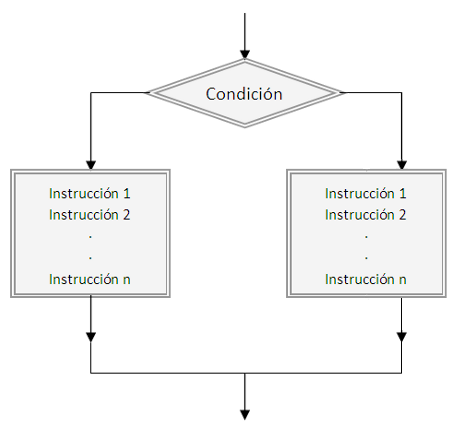

##  Arrays
* Otro de los tipos que tenemos en ECMASCript es el **array**
* Este tipo de dato nos permite guardar múltiples valores en una sola variable
* Podemos ver este tipo de datos como una colección
* La forma de crear un **array** es utilizando los corchetes y separar los valores utilzando comas


**Ejemplo:**
```js
['nico', 'pedro', 'juan', 'marta', 'belen', 'emilia', 'xime']
```
En este ejemplo tenemos un **array** que tiene 7 elementos, cada uno contiene un nombre.


Declararlo así en Javascript se podría hacer de esta forma:
```js
const alumnos = ['nico', 'pedro', 'juan', 'marta', 'belen', 'emilia', 'xime'];
```

Otra forma de escribirlo puede ser:
```js
const alumnos = [
  'nico', 
  'pedro', 
  'juan', 
  'marta', 
  'belen', 
  'emilia', 
  'xime'
];
```
También podemos crear un array vacío ya que no siempre sabemos que elementos va a tener:
```js
const alumnos = [];
```

### Obtener un array o colección desde un String
* Por medio del método **split** podemos obtener un **array** donde cada letra ocupa un espacio dentro de esta colección
* Acepta como primer parámetro un **string** que funcione como **separador**, es decir que necesitamos ayudar al método para que sepa donde cortar.
* Nos vamos a quedar con este concepto por ahora ya que no vimos **arrays** pero los vamos a ver más adelante
* En este momento nos alcanza con saber que un **array** es un tipo base de ECMAScript y que puede almacenar distintos valores al mismo tiempo y por eso se los conoce también como colección
* Podes leer más sobre este método en el [sitio del MDN](https://developer.mozilla.org/es/docs/Web/JavaScript/Referencia/Objetos_globales/String/split)

***Ejemplo:**
```js
let amigos = 'tute, mati, pepe, raul, juan, marta, agus, loli';
let listaDeAmigos = amigos.split(',');
console.log(listaDeAmigos);
/* Resultado
[ 
  'tute',
  ' mati',
  ' pepe',
  ' raul',
  ' juan',
  ' marta',
  ' agus',
  ' loli' 
]
*/
```

#### Prácticas
[Ejercicio 47](../ejercicios/consignas/js/ej47.md)

* Un array puede guardar cualquier tipo de dato

**Ejemplo:**
```js
const datos = [
  'hola', 
  42, 
  false, 
  null, 
  function() { console.log('hola') }
];
```

* Para obtener los datos de un array podemos utilizar el índice
* Los índices en ECMAScript comienzan en 0
* Es decir que el primer item lo podemos obtener con el índice 0

**Ejemplo:**
```js
const datos = [
  'hola', 
  42, 
  false, 
  null, 
  function() { console.log('hola') }
];

const saludo = datos[0];
const significadoDeLaVida = datos[1];
const casada = datos[2];
let miVariable = datos[3];
const saludar = datos[4];

console.log(saludo);
console.log(significadoDeLaVida);
console.log('casada?:', casada);
console.log(miVariable);

// Acá se viene el gran momento de tu vida:
saludar(); // muestra en consola hola
```

* En este ejemplo vemos que podemos acceder a los distintos elementos de un **array** utilizando un índice numérico
* Podemos almacenar todos los datos en otras variables
* En el caso de la función estamos simplemente asignando una función a la variable saludar como cualquier otro valor (ECMAScript nos deja hacer esto y es genial) y luego ejecutamos esta función (todo muy normal)

#### Prácticas
[Ejercicio 117](../ejercicios/consignas/js/ej117.md)
[Ejercicio 118](../ejercicios/consignas/js/ej118.md)
[Ejercicio 119](../ejercicios/consignas/js/ej119.md)

* También podemos asignar un valor a una posición de un array utilizando el índice

**Ejemplo:**
```js
const alumnos = ['nico', 'pedro', 'juan', 'marta', 'belen', 'emilia', 'xime'];
alumnos[0] = 'Pana';
alumnos[3] = 'Jorge';

console.log(alumnos);
// ['Pana', 'pedro', 'juan', 'Jorge', 'belen', 'emilia', 'xime']
```

* Tenemos que tener cuidado al asignar un item de un array

**Ejemplo:**
```js
const alumnos = ['nico', 'pedro',  'marta', 'belen', 'emilia'];
alumnos[8] = 'Paola';
console.log(alumnos);
// [ 'nico', 'pedro', 'marta', 'belen', 'emilia', , , , 'Paola' ]
```

* ECMAScript al manejar la memoria de forma dinámica asigna espacios vacíos en las posiciones donde no existen valores

**Ejemplo:**
```js
const alumnos = ['nico', 'pedro',  'marta', 'belen', 'emilia'];
alumnos[8] = 'Paola';
alumnos[5] = 'Lucas';
alumnos[6] = 'Lucy';
alumnos[7] = 'Andy';
console.log(alumnos);
/*
[ 
  'nico',
  'pedro',
  'marta',
  'belen',
  'emilia',
  'Lucas',
  'Lucy',
  'Andy',
  'Paola' 
]
*/
```
* En este caso completamos los datos que nos faltaban utilizando índices

#### Prácticas
[Ejercicio 120](../ejercicios/consignas/js/ej120.md)
[Ejercicio 121](../ejercicios/consignas/js/ej121.md)
[Ejercicio 122](../ejercicios/consignas/js/ej122.md)

### Métodos y Propiedades más utilizados del Array

### Longitud
* Por medio de la propiedad **length** podemos obtener la cantidad de elementos que tiene un **array**
* Funciona de la misma forma que la propiedad **length** de los **strings**

**Ejemplo:**
```js
const alumnos = ['nico', 'pedro',  'marta', 'belen', 'emilia'];
console.log(alumnos.length); // 5
```

* Podemos utilizar esta propiedad para obtener el último elemento de un array
* Si a la longitud de un array le restamos 1 obtenemos el último índice del último elemento

**Ejemplo:**
```js
const alumnos = ['nico', 'pedro',  'marta', 'belen', 'emilia'];
const cantidadDeElementos = alumnos.length;
const ultimoIndice = cantidadDeElementos - 1;
console.log(alumnos[ultimoIndice]); // emilia
```

* Otra forma de escribir esto es:
**Ejemplo:**
```js
const alumnos = ['nico', 'pedro',  'marta', 'belen', 'emilia'];
console.log(alumnos[ alumnos.length - 1 ]); // emilia
```

* Vemos que podemos utilizar la propiedad length - 1 para obtener el último índice y luego obtener el último elemento

#### Prácticas
[Ejercicio 123](../ejercicios/consignas/js/ej123.md)
[Ejercicio 124](../ejercicios/consignas/js/ej124.md)

### Push, unshift, shift y pop
* Utilizando los métodos **push, unshift, shift y pop** podemos alterar los elementos de un array

#### Push
* El método **push** permite agregar uno o más elementos al final de un array
* Retorna la nueva longitud que tiene el array
* Podes leer más sobre push en el [sitio del MDN](https://developer.mozilla.org/es/docs/Web/JavaScript/Referencia/Objetos_globales/Array/push)

**Ejemplo:**
```js
const animales = ['perro', 'pato', 'vaca'];
let cantidadDeAnimales = animales.push('gato');

console.log(animales);
// [ 'perro', 'pato', 'vaca', 'gato' ]
console.log(cantidadDeAnimales); // 4

cantidadDeAnimales = animales.push('elefante', 'delfin');

console.log(animales);
// [ 'perro', 'pato', 'vaca', 'gato', 'elefante', 'delfin' ]
console.log(cantidadDeAnimales); // 6
```

* En este ejemplo vemos varias cosas interesantes
* Por un lado con el método **push** podemos agregar un elemento a un array como en el caso de **gato** o varios como en el caso de **elefante y delfin**
* Estamos modificando el array original **animales**, es decir que estamos mutando su valor
* Al declarar una array utilizando **const** nos permite tener una constante pero podemos cambiar los elementos que tiene esta colección. 
* En caso de asignar otro valor a la variable obtenemos el mismo error de siempre

#### Unshift
* El método **unshift** agrega uno o más elementos al inicio de un array
* Retorna la nueva longitud que tiene el array
* Podes leer más sobre **unshift** en el [sitio del MDN](https://developer.mozilla.org/es/docs/Web/JavaScript/Referencia/Objetos_globales/Array/unshift)

**Ejemplo:**
```js
const animales = ['perro', 'pato', 'vaca'];
let cantidadDeAnimales = animales.unshift('gato');

console.log(animales); 
// [ 'gato', 'perro', 'pato', 'vaca' ]
console.log(cantidadDeAnimales); // 4

cantidadDeAnimales = animales.unshift('elefante', 'delfin');

console.log(animales);
// [ 'elefante', 'delfin', 'gato', 'perro', 'pato', 'vaca' ]
console.log(cantidadDeAnimales); // 6
```

* Podemos decir que funciona como push pero en lugar de insertar los elementos al final lo hace al principio

#### Shift
* El método **shift** elimina el primer elemento de un array
* Retorna el elemento eliminado
* Este método modifica la propiedad **length** del array
* Podes leer más sobre **shift** en el [sitio del MDN](https://developer.mozilla.org/es/docs/Web/JavaScript/Referencia/Objetos_globales/Array/shift)

**Ejemplo:**
```js
const animales = ['perro', 'pato', 'vaca'];
const perro = animales.shift();
console.log(animales);
// ['pato', 'vaca']
console.log(animales.length);
// 2

const pato = animales.shift();
console.log(animales);
// ['vaca']
console.log(animales.length);
// 1

const vaca = animales.shift();
console.log(animales);
// []
console.log(animales.length);
// 0

console.log(perro); // perro
console.log(pato); // pato
console.log(vaca); // vaca
```

* Podemos ver como utilizando el método **shift** podemos obtener el primer elemento y eliminarlo del array
* Al sacar un elemento se modifica la propiedad **length** del array

#### Pop
* El método **pop** elimina el último elemento de un array
* Retorna el elemento eliminado
* Este método modifica la propiedad **length** del array
* Podes leer más sobre **pop** en el [sitio del MDN](https://developer.mozilla.org/es/docs/Web/JavaScript/Referencia/Objetos_globales/Array/pop)

**Ejemplo:**
```js
const animales = ['perro', 'pato', 'vaca'];
const vaca = animales.pop();
console.log(animales);
// ['perro', 'pato']
console.log(animales.length);
// 2

const pato = animales.shift();
console.log(animales);
// ['perro']
console.log(animales.length);
// 1

const perro = animales.shift();
console.log(animales);
// []
console.log(animales.length);
// 0

console.log(vaca); // vaca
console.log(pato); // pato
console.log(perro); // perro
```

* Vemos que el método pop funciona de manera similar que shift

### Sort y reverse

#### Sort
* Utilizando el método **sort** podemos ordenar un array
* Retorna el array ordenado
* Los elementos son ordenados convirtiéndolos a strings y comparando la posición del valor Unicode de dichos strings
* Podes leer más sobre **sort** en el [sitio del MDN](https://developer.mozilla.org/es/docs/Web/JavaScript/Referencia/Objetos_globales/Array/sort)

**Ejemplo:**
```js
let numeros = [1, 4, 2, 5, 3, 8, 9];
numeros = numeros.sort();

console.log(numeros);
// [ 1, 2, 3, 4, 5, 8, 9 ]
```

* Al ordenar utilizando los elementos usando strings y la posición en la tabal de Unicode se pueden dar resultados que no son los esperados
* También tenemos la opción de pasar una función de ordenado para establecer la forma que queremos ordenarlo

#### Reverse
* El método **reverse** nos permite revertir el orden que tiene un array
* Retorna el array modificado
* Podes leer más sobre **reverse** en el [sitio del MDN](https://developer.mozilla.org/es/docs/Web/JavaScript/Referencia/Objetos_globales/Array/reverse)

**Ejemplo:**
```js
let numeros = [1, 4, 2, 5, 3, 8, 9];
numeros = numeros.reverse();

console.log(numeros);
[ 9, 8, 3, 5, 2, 4, 1 ]
```

### Concat y join
* Con los métodos **concat** y **join** podemos unir arrays de distintas formas

#### Join
* El método **join** permite unir los valores de un array en un string
* Acepta como valor un string para unir los elementos
* Podes leer más sobre **join** en el [sitio del MDN](https://developer.mozilla.org/es/docs/Web/JavaScript/Referencia/Objetos_globales/Array/join)

**Ejemplo:**
```js
const numeros = [1, 4, 2, 5, 3, 8, 9];
let resultado = numeros.join(' - ');

console.log(resultado);
// 1 - 4 - 2 - 5 - 3 - 8 - 9

resultado = numeros.join(', ');

console.log(resultado);
// 1, 4, 2, 5, 3, 8, 9
```

* Podemos unir los valores del array utilizando un concepto que queremos como por ejemplo el '-' o ','

#### Concat
* El método **concat** nos permite unir 2 arrays y obtener un nuevo array con los elementos de ambos
* Podes leer más sobre **concat** en el [sitio del MDN](https://developer.mozilla.org/es/docs/Web/JavaScript/Referencia/Objetos_globales/Array/concat)

**Ejemplo:**
```js
const animales = ['perro', 'vaca', 'gato'];
const mutantes = ['Charles Xavier', 'Cíclope', 'Bestia', 'Jean Grey'];
const animalesMutantes = animales.concat(mutantes);

console.log(animalesMutantes);
/*
[ 
  'perro',
  'vaca',
  'gato',
  'Charles Xavier',
  'Cíclope',
  'Bestia',
  'Jean Grey' 
]
*/
```

### IndexOf
* El método **indexOf** retorna el primer índice donde se encuentra un elemento
* Si no encuentra el elemento buscado **retorna -1**
* Podes leer más sobre **indexOf** en el [sitio del MDN](https://developer.mozilla.org/es/docs/Web/JavaScript/Referencia/Objetos_globales/Array/indexOf)

**Ejemplo:**
```js
const mutantes = ['Charles Xavier', 'Cíclope', 'Bestia', 'Jean Grey'];

if (mutantes.indexOf('Bestia') > -1) {
  console.log('Bestia es parte de los mutantes');
}

// Bestia es parte de los mutantes

if (mutantes.indexOf('Logan') > -1) {
  console.log('Logan es parte de los mutantes');
} else {
  console.log('Logan no es parte de los mutantes');
}
// Logan no es parte de los mutantes
```

* En la primer condición se cumple ya que indexOf retorna la posición 2 donde se encuentra el elemento Bestia
* En la segunda condición no se cumple ya que indexOf retorna -1 ya que Logan no es parte del array mutantes en este momento

### toString
* El método **toString** nos retorna la representación del contenido de un array en string
* Es similar a **join** pero no sabemos como une los elementos ya que no lo especificamos
* Podes leer más sobre **toString** en el [sitio del MDN](https://developer.mozilla.org/en-US/docs/Web/JavaScript/Reference/Global_Objects/Array/toString)

**Ejemplo:**
```js
const mutantes = ['Charles Xavier', 'Cíclope', 'Bestia', 'Jean Grey'];
console.log(mutantes.toString());
// 'Charles Xavier', 'Cíclope', 'Bestia', 'Jean Grey'
```

#### Prácticas
[Ejercicio 125](../ejercicios/consignas/js/ej125.md)
[Ejercicio 126](../ejercicios/consignas/js/ej126.md)
[Ejercicio 127](../ejercicios/consignas/js/ej127.md)
[Ejercicio 128](../ejercicios/consignas/js/ej128.md)
[Ejercicio 129](../ejercicios/consignas/js/ej129.md)
[Ejercicio 130](../ejercicios/consignas/js/ej130.md)
[Ejercicio 131](../ejercicios/consignas/js/ej131.md)
[Ejercicio 132](../ejercicios/consignas/js/ej132.md)
[Ejercicio 133](../ejercicios/consignas/js/ej133.md)
[Ejercicio 134](../ejercicios/consignas/js/ej134.md)

## Estructuras de control
Por medio de las estructuras de control podemos controlar el flujo de nuestro código y como queremos que se ejecute según se cumplan o no algunas condiciones

### If

* Una de las estructuras más utilizadas, y la más simple, es el **if** (que podríamos traducir como "si sucede que").
* Esta estructura espera una condición **true** para que ingrese y ejecute el código que tiene dentro de su _bloque_. Un bloque es un conjunto de líneas de código encerrado entre llaves `{}`.


* Como vemos en esta imágen (un diagrama de flujo) tenemos una condición que se va a resolver en true o false
* En caso de que la condición sea verdadera (true) se va a ejecutar las distintas instrucciones
* En caso de que la condición sea negativa (false) no se ejecutan las instrucciones declaradas dentro de esta estructura y el código sigue su flujo

**Ejemplo:**
```js
// Estructura básica de un if
if (condicion) {
  // Se ejecuta el código que se escriba en esta sección si la condición es verdadera.
}
```

```js
if (true) {
  console.log('Se muestra este texto ya que la condición es true');
}
```

* Como podemos ver en el ejemplo anterior siempre se va a mostrar el mensaje ya que la condición siempre va a ser **true**
* Podemos escribir distintas condiciones que nos permitan elegir si vamos a ejecutar el código dentro de la estructura o no
* Por ejemplo podemos preguntar **SI** el **numero** es mayor o igual que 2 **Entonces** mostrar un mensaje en consola

**Ejemplo:**
```js
const numero = 2;

// SI numero >= 2 ENTONCES mostrar en consola
if (numero >= 2) {
  console.log('El numero es mayor o igual a 2');
}
```

* El flujo del código se sigue ejecutando sin importar el resultado del if

**Ejemplo:**
```js
const numero = 1;

if (numero >= 2) {
  console.log('Este mensaje no se ve');
}

console.log('Este mensaje se ve siempre se cumpla o no la condición del if');
```

#### Prácticas
[Ejercicio 49](../ejercicios/consignas/js/ej49.md)
[Ejercicio 50](../ejercicios/consignas/js/ej50.md)
[Ejercicio 51](../ejercicios/consignas/js/ej51.md)

* También existe la estructura if/else que nos permite controlar que pasa si la condición es falsa
* Es decir que en caso de que la condición sea verdadera entra en una parte de la estructura
* En caso de ser falsa la condición entonces entra en la otra sección
* Utilizamos la palabra **else** para el "si no, entonces..."



**Ejemplo:**
```js
if (condicion) {
  // Entra en esta sección si se cumple la condición
} else {
  // Entra en esta sección si no se cumple la condición
}
```

```js
const numero = 2;

if (numero === 2) {
  console.log('El número es 2');
} else {
  console.log('El número no es 2');
}
```

* Podemos leer este código de la siguiente manera: SI el número es igual a 2 entonces mostrar el mensaje 'El número es 2' SINO mostrar el mensaje 'El número no es 2'

#### Prácticas
[Ejercicio 52](../ejercicios/consignas/js/ej52.md)
[Ejercicio 53](../ejercicios/consignas/js/ej53.md)
[Ejercicio 54](../ejercicios/consignas/js/ej54.md)

### Operador Ternario
* Existe una manera más corta de escribir un if/else y es por medio del operador ternario
* Se escribe de la siguiente manera: `(condicion) ? true : false`
* Es decir que dada una condición se ejecuta una parte o la otra

**Ejemplo:**
```js
let numero = 2;
let mensaje = (numero === 2) ? 'El numero es 2' : 'El numero no es 2';
console.log(mensaje);
```

#### Prácticas
[Ejercicio 55](../ejercicios/consignas/js/ej55.md)
[Ejercicio 56](../ejercicios/consignas/js/ej56.md)
[Ejercicio 57](../ejercicios/consignas/js/ej57.md)

### If Anidados
* Podemos anidar estructuras if/else/if para validar distintas condiciones

**Ejemplo:**
```js
if (condicion) {
  // primer condicion
} else if (otraCondicion) {
  // segunda condicion
} else {
  // Si no se cumplio ninguna de las anteriores ingresa acá
}
```

```js
const nombre = 'Marta';

if (nombre === 'Miriam') {
  console.log('El nombre de la usuaria es Miriam');
} else if (nombre === 'Felipa') {
  console.log('El nombre de la usuaria es Felipa');
} else {
  console.log('El nombre de la usuaria no es Marta ni Felipa');
}
```

* Podemos ver en este ejemplo que podemos preguntar por distintas condiciones

#### Prácticas
[Ejercicio 58](../ejercicios/consignas/js/ej58.md)
[Ejercicio 59](../ejercicios/consignas/js/ej59.md)
[Ejercicio 60](../ejercicios/consignas/js/ej60.md)

* Utilizar muchos if's anidados no es una buena práctica
